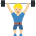
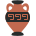

| Emoji         | Emoji Unicode     |
| :-----------: | ----------------- |
|  | 1f1f9-1f1f2 |
|  | 23f8 |
|  | 1f473 |
|  | 1f9d1-200d-2708-fe0f |
|  | 1f1fe |
|  | 1f64d-1f3fc-200d-2642-fe0f |
|  | 1f9fe |
|  | 1f3d3 |
|  | 2716 |
|  | 1f1fe-1f1ea |
|  | 1f509 |
|  | 1f469-1f3fc-200d-1f37c |
|  | 1f469-1f3fb-200d-1f91d-200d-1f469-1f3fe |
|  | 1f469-1f3fe-200d-1f91d-200d-1f469-1f3fb |
|  | 1f49b |
|  | 1faf3-1f3fd |
|  | 1f468-1f3fd-200d-1f373 |
|  | 21a9 |
|  | 1f926-1f3fe |
|  | 1f469-1f3fc-200d-2764-fe0f-200d-1f48b-200d-1f469-1f3fc |
|  | 1f926-1f3fb-200d-2642-fe0f |
|  | 1f646-1f3fe-200d-2640-fe0f |
|  | 1f485-1f3ff |
|  | 1f1ec-1f1f1 |
|  | 1f4af |
|  | 1f44f-1f3fe |
|  | 1f9d7-1f3fb |
|  | 1f1ea-1f1f9 |
|  | 1f469-1f3fb-200d-1f692 |
|  | 1f468-1f3fc-200d-1f9bc |
|  | 1f945 |
|  | 1f9bb-1f3ff |
|  | 1f558 |
|  | 1f590-1f3fc |
|  | 1f3e0 |
|  | 1f64e-1f3ff |
|  | 1fa81 |
|  | 1f469-1f3fe-200d-1f680 |
|  | 26e9 |
|  | 1f54b |
|  | 1f3cb-1f3fd-200d-2640-fe0f |
|  | 1f469-1f3fe-200d-1f91d-200d-1f469-1f3fd |
|  | 1f9d1-1f3fc-200d-1f4bc |
|  | 267b |
|  | 1f469-1f3fc-200d-2695-fe0f |
|  | 1f3c7 |
|  | 1f9b5-1f3ff |
|  | 1f9c0 |
|  | 1f4c2 |
|  | 1f93a |
|  | 26f9-1f3fe |
|  | 1f468-1f3ff-200d-1f3a8 |
|  | 1f6de |
|  | 1faf3 |
|  | 1f469-1f3fd-200d-2764-fe0f-200d-1f469-1f3fe |
|  | 1f97b |
|  | 1f9a2 |
|  | 1f500 |
|  | 1f9d4-1f3fb |
|  | 1f468-1f3fd-200d-1f4bc |
|  | 1f6f9 |
|  | 1f469-1f3fd-200d-2764-fe0f-200d-1f469-1f3fd |
|  | 39-20e3 |
|  | 1f48f-1f3fb |
|  | 1f3c4-1f3ff-200d-2642-fe0f |
|  | 1f482-1f3fe-200d-2640-fe0f |
|  | 1f487-1f3fb |
|  | 1f556 |
|  | 1f468-200d-1f4bb |
|  | 1f468-1f3ff-200d-1f373 |
|  | 1f51c |
|  | 1f468-1f3fb-200d-2696-fe0f |
|  | 1f91b |
|  | 1f9d9-1f3fe |
|  | 1f454 |
|  | 1f469-1f3fc-200d-2764-fe0f-200d-1f469-1f3fb |
|  | 1f647-1f3fc |
|  | 1faaa |
|  | 1f461 |
|  | 1f9a1 |
|  | 2714 |
|  | 1f46e-1f3ff-200d-2642-fe0f |
|  | 1f9cd-1f3fe |
|  | 1f1f2 |
|  | 1f939-1f3fe-200d-2642-fe0f |
|  | 1f9b9 |
|  | 1f468-1f3fb-200d-1f9b2 |
|  | 1f6b6-1f3ff-200d-2642-fe0f |
|  | 1f99d |
|  | 2728 |
|  | 1f468-1f3fe-200d-1f9b0 |
|  | 1f9dd-1f3fd-200d-2640-fe0f |
|  | 1f9b0 |
|  | 1f447-1f3fb |
|  | 1f468-1f3ff-200d-1f37c |
|  | 1f3ca-1f3ff-200d-2640-fe0f |
|  | 26f7-1f3fc |
|  | 1f487-1f3fe |
|  | 1f9b8-1f3fb-200d-2642-fe0f |
|  | 1f6b6-1f3fe-200d-2640-fe0f |
|  | 1f447 |
|  | 1f486-1f3fe |
|  | 1fab6 |
|  | 1f30a |
|  | 1f35f |
|  | 1f469-1f3fd-200d-2695-fe0f |
|  | 1f469-1f3fe-200d-1f91d-200d-1f468-1f3ff |
|  | 1f1e8-1f1f1 |
|  | 1fab0 |
|  | 1f471-1f3fb |
|  | 1f9d1-1f3fc-200d-1f91d-200d-1f9d1-1f3fe |
|  | 1f471-1f3fc |
|  | 1f1f7-1f1f4 |
|  | 1faf5-1f3fb |
|  | 1f468-1f3fd-200d-2696-fe0f |
|  | 1f44f |
|  | 1fac4-1f3fd |
|  | 1f565 |
|  | 270d |
|  | 1fa96 |
|  | 1f1ee-1f1f3 |
|  | 1f468-1f3fe-200d-1f9bd |
|  | 1f9ea |
|  | 1f468-1f3fd-200d-2708-fe0f |
|  | 1f9d3-1f3fc |
|  | 1f469-1f3ff-200d-1f3a8 |
|  | 1f9ce |
|  | 1f918 |
|  | 1f469-1f3fb-200d-2764-fe0f-200d-1f469-1f3fc |
|  | 1f9cf-1f3ff |
|  | 26be |
|  | 1f469-1f3fc-200d-1f91d-200d-1f468-1f3fd |
|  | 1f986 |
|  | 1f1ec-1f1fa |
|  | 1f481-200d-2640-fe0f |
|  | 1f468-1f3fc-200d-1f91d-200d-1f468-1f3ff |
|  | 1f3c4-1f3fc |
|  | 1f3cc-1f3fb |
|  | 1f937-1f3fd |
|  | 1f647-1f3ff-200d-2640-fe0f |
|  | 1f46e-1f3fe-200d-2640-fe0f |
|  | 1f6b4-1f3fb-200d-2642-fe0f |
|  | 1f9d1-1f3fc-200d-1f91d-200d-1f9d1-1f3fc |
|  | 1f48d |
|  | 1faf6-1f3fb |
|  | 1f474-1f3fb |
|  | 1f7e5 |
|  | 1f467-1f3fc |
|  | 1f469-1f3fc-200d-1f384 |
|  | 1f692 |
|  | 1f646-1f3fc |
|  | 1f578 |
|  | 36-20e3 |
|  | 1f5f3 |
|  | 1f478-1f3fb |
|  | 23e9 |
|  | 1f469-200d-1f692 |
|  | 1f520 |
|  | 1f9cd-200d-2642-fe0f |
|  | 1f64b-1f3fb-200d-2642-fe0f |
|  | 1f9bb-1f3fe |
|  | 1f64f-1f3fd |
|  | 1f9d1-1f3fc-200d-1f393 |
|  | 1f9d1-1f3fb-200d-2764-fe0f-200d-1f9d1-1f3ff |
|  | 1f469-1f3fe-200d-1f4bb |
|  | 1f948 |
|  | 1f9d1-1f3fb-200d-1f9b0 |
|  | 1f9b6-1f3fe |
|  | 1f64d-1f3fc-200d-2640-fe0f |
|  | 1f3e5 |
|  | 269c |
|  | 1f58c |
|  | 1f469-1f3fb-200d-1f4bc |
|  | 1f3be |
|  | 1f90d |
|  | 1f4b5 |
|  | 1f469-200d-2764-fe0f-200d-1f48b-200d-1f469 |
|  | 1f469-1f3fd-200d-1f91d-200d-1f469-1f3fe |
|  | 1f469-1f3fd-200d-1f4bb |
|  | 1f485-1f3fd |
|  | 1f9b8-1f3fd |
|  | 1f919-1f3ff |
|  | 1f685 |
|  | 270c-1f3fe |
|  | 1f4c3 |
|  | 1f468-1f3fb-200d-1f527 |
|  | 1f468-1f3ff-200d-2696-fe0f |
|  | 1f616 |
|  | 1f1e8 |
|  | 1f99c |
|  | 1f3ea |
|  | 1f468-1f3fb-200d-2764-fe0f-200d-1f468-1f3fb |
|  | 1f469-1f3fb-200d-1f9b3 |
|  | 1f645-1f3ff-200d-2642-fe0f |
|  | 1f1f8-1f1e6 |
|  | 1f576 |
|  | 1f327 |
|  | 1f34a |
|  | 1f33a |
|  | 1f469-1f3fe-200d-2764-fe0f-200d-1f468-1f3ff |
|  | 1f1f9-1f1f9 |
|  | 1f9ce-1f3fc-200d-2642-fe0f |
|  | 1f549 |
|  | 1f937-1f3fe-200d-2642-fe0f |
|  | 1f9d1-1f3ff-200d-1f91d-200d-1f9d1-1f3fc |
|  | 1f93d-1f3fb-200d-2640-fe0f |
|  | 1f359 |
|  | 1faf5-1f3fd |
|  | 1f9d1-1f3fc-200d-1f680 |
|  | 264f |
|  | 1f466-1f3fd |
|  | 1f9d1-1f3fd-200d-1f91d-200d-1f9d1-1f3fb |
|  | 26f9-1f3fb-200d-2642-fe0f |
|  | 1f937-1f3ff |
|  | 1f997 |
|  | 1f937-1f3fc |
|  | 1f62d |
|  | 1f64f-1f3fc |
|  | 1faf1-1f3fc-200d-1faf2-1f3fb |
|  | 1f1f2-1f1f2 |
|  | 1f469-1f3fc-200d-2764-fe0f-200d-1f48b-200d-1f468-1f3fd |
|  | 1f41d |
|  | 1f468-1f3fb-200d-1f4bb |
|  | 1f9d9-1f3ff-200d-2640-fe0f |
|  | 1f930-1f3fe |
|  | 1f937-1f3fc-200d-2642-fe0f |
|  | 1f469-1f3fc-200d-2764-fe0f-200d-1f48b-200d-1f468-1f3ff |
|  | 1f468-1f3fe-200d-2708-fe0f |
|  | 1f3c4-1f3fe |
|  | 1f469-1f3ff-200d-2764-fe0f-200d-1f468-1f3fb |
|  | 1f469-1f3ff-200d-1f91d-200d-1f469-1f3fd |
|  | 1f9b8-1f3fd-200d-2642-fe0f |
|  | 1f9dc-1f3fe-200d-2640-fe0f |
|  | 1f9d1-1f3ff-200d-1f91d-200d-1f9d1-1f3fe |
|  | 2935 |
|  | 1f1ec-1f1fe |
|  | 26aa |
|  | 1f9dc |
|  | 1f92e |
|  | 1f935-1f3fd-200d-2640-fe0f |
|  | 1f6b4-1f3fc-200d-2642-fe0f |
|  | 1f618 |
|  | 1f1f8-1f1f8 |
|  | e50a |
|  | 2198 |
|  | 1f468-1f3fe-200d-2695-fe0f |
|  | 1f6f4 |
|  | 1f468-1f3fd-200d-1f3a4 |
|  | 1f64e-1f3fb |
|  | 2695 |
|  | 1f1ec-1f1f7 |
|  | 1f34d |
|  | 1f9da-1f3fd-200d-2642-fe0f |
|  | 1fa9b |
|  | 1f552 |
|  | 1f64d-200d-2640-fe0f |
|  | 1f9dd-1f3fe-200d-2640-fe0f |
|  | 1f647-1f3ff-200d-2642-fe0f |
|  | 26f9-1f3fb |
|  | 1f92b |
|  | 1f469-1f3ff-200d-1f4bc |
|  | 1f44e |
|  | 1f3e4 |
|  | 1f380 |
|  | 1f469-1f3fd-200d-1f9b3 |
|  | 1f9d1-200d-1f9af |
|  | 1f575-1f3fd-200d-2640-fe0f |
|  | 1f1f5-1f1f9 |
|  | 1f1f8 |
|  | 1f469-200d-1f466-200d-1f466 |
|  | 1f468-200d-1f3a8 |
|  | 1f9d1-1f3ff-200d-1f91d-200d-1f9d1-1f3fd |
|  | 1f3d5 |
|  | 1f3cb-1f3fe-200d-2642-fe0f |
|  | 1f608 |
|  | 1f7eb |
|  | 1f469-1f3fb-200d-2764-fe0f-200d-1f468-1f3fc |
|  | 1fa9f |
|  | 1f6a3-1f3fc |
|  | 1f469-200d-1f9bc |
|  | 1f922 |
|  | 1f9d1-1f3fb-200d-1f4bb |
|  | 1f491-1f3fd |
|  | 1fae2 |
|  | 1fa93 |
|  | 1f1ef-1f1f4 |
|  | 1f468-200d-1f466 |
|  | 1f468-1f3fb-200d-1f91d-200d-1f468-1f3ff |
|  | 1f6b5-1f3fd |
|  | 1f250 |
|  | 1f469-1f3fb-200d-1f91d-200d-1f468-1f3fc |
|  | 1f934-1f3fd |
|  | 1f468-1f3fb-200d-1f3ed |
|  | 1f46b-1f3fd |
|  | 1f485-1f3fb |
|  | 1f6b6-200d-2640-fe0f |
|  | 1f977-1f3fb |
|  | 1f468-200d-1f468-200d-1f467-200d-1f467 |
|  | 1f9ce-1f3fb-200d-2640-fe0f |
|  | 1f4e7 |
|  | 1f9d1-1f3fd-200d-1f9b0 |
|  | 1f7e6 |
|  | 1f472-1f3ff |
|  | 1f952 |
|  | 1f947 |
|  | 1f518 |
|  | 1f390 |
|  | 1f1f2-1f1f5 |
|  | 274c |
|  | 1f31d |
|  | 1f4ef |
|  | 26ce |
|  | 1f469-200d-1f3a4 |
|  | 1f3f0 |
|  | 1faa5 |
|  | 1f9ce-1f3fc-200d-2640-fe0f |
|  | 1f64e-1f3fc |
|  | 1f93e-1f3fb-200d-2642-fe0f |
|  | 1f330 |
|  | 1f1f1-1f1f0 |
|  | 1f62a |
|  | 1f470 |
|  | 1f47c-1f3ff |
|  | 1f9b1 |
|  | 1f1e8-1f1f2 |
|  | 1f9db-1f3fc |
|  | 1f469-200d-1f9bd |
|  | 1f3cb-1f3fc-200d-2642-fe0f |
|  | 1f9ec |
|  | 1f9da-1f3ff |
|  | 1f9cf-1f3fc-200d-2642-fe0f |
|  | 1f9d1-1f3fe-200d-1f91d-200d-1f9d1-1f3fd |
|  | 1f939-1f3fb-200d-2640-fe0f |
|  | 1f319 |
|  | a9 |
|  | 1f1fc-1f1f8 |
|  | 1f9cd-1f3fc-200d-2640-fe0f |
|  | 2721 |
|  | 1f441 |
|  | 1f91a |
|  | 1f919-1f3fb |
|  | 1f9d9-1f3fd |
|  | 1f469-1f3fe-200d-1f3a8 |
|  | 1f9d1-1f3fb-200d-1f9af |
|  | 1f449 |
|  | 1f381 |
|  | 1f469-1f3fe-200d-1f91d-200d-1f468-1f3fc |
|  | 1f96c |
|  | 2b1c |
|  | 1f937-1f3fd-200d-2640-fe0f |
|  | 1f93e-1f3ff-200d-2642-fe0f |
|  | 1f9d1-1f3fe-200d-1f3a8 |
|  | 1f469-1f3fd-200d-2764-fe0f-200d-1f48b-200d-1f468-1f3fd |
|  | 1f468-1f3fe-200d-1f9b3 |
|  | 1f345 |
|  | 1f9ce-1f3fd-200d-2640-fe0f |
|  | 1f477-1f3fe-200d-2642-fe0f |
|  | 1f4a4 |
|  | 1f6a3-1f3ff-200d-2640-fe0f |
|  | 1f631 |
|  | 1f9dd-1f3fd-200d-2642-fe0f |
|  | 1f44d-1f3fc |
|  | 1f469-1f3fd-200d-1f9b1 |
|  | 1f60f |
|  | 1f442-1f3fb |
|  | 1f468-1f3fe-200d-1f3a8 |
|  | 1f469-1f3fd-200d-2764-fe0f-200d-1f469-1f3fc |
|  | 1f64b |
|  | 1f6b5-1f3fc-200d-2640-fe0f |
|  | 26ea |
|  | 1f1e7-1f1f1 |
|  | 1f43b-200d-2744-fe0f |
|  | 1f45e |
|  | 2602 |
|  | 1f3cc-1f3fc-200d-2640-fe0f |
|  | 1f4b3 |
|  | 1f468-1f3ff-200d-1f3a4 |
|  | 1f5e8 |
|  | 1f342 |
|  | 1f3ca-1f3fd-200d-2640-fe0f |
|  | 1f470-1f3fd-200d-2642-fe0f |
|  | 1f22f |
|  | 1f469-1f3fd-200d-1f384 |
|  | 1f468-200d-1f3eb |
|  | 1f9d1-1f3fd-200d-1f91d-200d-1f9d1-1f3fc |
|  | 1f469-1f3fe-200d-2764-fe0f-200d-1f48b-200d-1f469-1f3ff |
|  | 1f46b |
|  | 1faf4-1f3fd |
|  | 1faba |
|  | 1f4c6 |
|  | 1f3cb-1f3fb-200d-2640-fe0f |
|  | 1f391 |
|  | 1f637 |
|  | 24c2 |
|  | 1f64e-1f3fc-200d-2642-fe0f |
|  | 1f450-1f3ff |
|  | 1f64f-1f3ff |
|  | 1f468-1f3fe-200d-2764-fe0f-200d-1f468-1f3ff |
|  | 1f9d1-1f3fd-200d-2764-fe0f-200d-1f9d1-1f3fe |
|  | 1fac4-1f3fc |
|  | 1f3e7 |
|  | 1f469-1f3fb-200d-2695-fe0f |
|  | 26f9-1f3fb-200d-2640-fe0f |
|  | 1f60b |
|  | 1f469-1f3fd-200d-2764-fe0f-200d-1f468-1f3fc |
|  | 1f468-1f3fd-200d-1f393 |
|  | 1f42f |
|  | 1f1f2-1f1fd |
|  | 1f3c3-1f3fe |
|  | 1fab5 |
|  | 1faf6 |
|  | 1f91e-1f3fd |
|  | 1f502 |
|  | 1f976 |
|  | 2648 |
|  | 1f9d4-1f3ff |
|  | 1f4aa-1f3fc |
|  | 1f574-1f3ff-200d-2642-fe0f |
|  | 1faf1-1f3fe-200d-1faf2-1f3fc |
|  | 1f1ef |
|  | 1f929 |
|  | 1f9cf |
|  | 1f477-1f3fb-200d-2640-fe0f |
|  | 1f9d4-1f3fc-200d-2642-fe0f |
|  | 1f64d-1f3fd-200d-2640-fe0f |
|  | 1f469-200d-2695-fe0f |
|  | 1f469-1f3fb-200d-2764-fe0f-200d-1f469-1f3ff |
|  | 1f9d1-1f3fd-200d-1f3eb |
|  | 1fa91 |
|  | 1f196 |
|  | 1fac1 |
|  | 1f64f-1f3fb |
|  | 1f647-1f3fe |
|  | 1f1f8-1f1f1 |
|  | 1f469-1f3fe-200d-2764-fe0f-200d-1f468-1f3fd |
|  | 23ef |
|  | 1f49a |
|  | 1f481-1f3ff |
|  | 1f1f1-1f1e6 |
|  | 1f98a |
|  | 23f9 |
|  | 1f61c |
|  | 1f469-1f3ff-200d-1f9af |
|  | 1f937-1f3fe-200d-2640-fe0f |
|  | 1f9d1-1f3fb-200d-1f91d-200d-1f9d1-1f3fd |
|  | 1f3c3-1f3fb |
|  | 1f9d6-1f3ff-200d-2642-fe0f |
|  | 1f58d |
|  | 1f9b4 |
|  | 1f9b9-1f3fe-200d-2640-fe0f |
|  | 2b1b |
|  | 1f468-1f3fb-200d-1f91d-200d-1f468-1f3fe |
|  | 1f1e8-1f1eb |
|  | 1f9d1-1f3ff-200d-1f37c |
|  | 1f1e6 |
|  | 1faf1-1f3ff-200d-1faf2-1f3fd |
|  | 1f57a-1f3fb |
|  | 1f3cc-1f3fd-200d-2640-fe0f |
|  | 1f9d1-1f3fe-200d-1f393 |
|  | 1f442-1f3ff |
|  | 1f32b |
|  | 1f469-1f3fc-200d-2764-fe0f-200d-1f48b-200d-1f469-1f3fd |
|  | 1f469-1f3fd-200d-1f37c |
|  | 1f935-1f3fc |
|  | 1f469-1f3ff-200d-2708-fe0f |
|  | 1f1ed-1f1f2 |
|  | 1f496 |
|  | 1f469-1f3fb-200d-2764-fe0f-200d-1f48b-200d-1f468-1f3ff |
|  | 1f5c4 |
|  | 1f3db |
|  | 1f469-1f3fb-200d-2764-fe0f-200d-1f469-1f3fb |
|  | 2049 |
|  | 1f4b2 |
|  | 1f3cc-1f3ff |
|  | 1f468-1f3fe-200d-1f527 |
|  | 1f6b0 |
|  | 1f477-1f3fe-200d-2640-fe0f |
|  | 1f3c2 |
|  | 1f6b4-200d-2642-fe0f |
|  | 1f574-1f3fd-200d-2640-fe0f |
|  | 1f481-200d-2642-fe0f |
|  | 1f1f1 |
|  | 1f9d1-1f3fb-200d-1f9bd |
|  | 1f6f3 |
|  | 2603 |
|  | 1f469-1f3fb-200d-1f4bb |
|  | 1f60c |
|  | 1f4e2 |
|  | 1f469-1f3ff-200d-1f384 |
|  | 1f1fc-1f1eb |
|  | 1f9d6-1f3ff-200d-2640-fe0f |
|  | 1f339 |
|  | 1f469-200d-2764-fe0f-200d-1f48b-200d-1f468 |
|  | 1f981 |
|  | 1f47f |
|  | 1f6cc-1f3fd |
|  | 1f1f6 |
|  | 1f6b6 |
|  | 1f9de |
|  | 1f9d1-1f3ff-200d-2764-fe0f-200d-1f9d1-1f3fd |
|  | 1f1ea-1f1f7 |
|  | 1f324 |
|  | 1f9d2-1f3ff |
|  | 1f9b8-1f3fc |
|  | 1f17f |
|  | 1f50d |
|  | 1f475-1f3fd |
|  | 1f3c7-1f3fe |
|  | 1f467-1f3fb |
|  | 1f485-1f3fc |
|  | 1f9db-1f3fd |
|  | 1f6a3-1f3ff |
|  | 1f5de |
|  | 1f49c |
|  | 1f9d1-1f3fb-200d-1f3a4 |
|  | 1f529 |
|  | 1f9bb-1f3fd |
|  | 1f469-1f3fd-200d-2764-fe0f-200d-1f48b-200d-1f469-1f3fe |
|  | 1f468-1f3fd-200d-1f91d-200d-1f468-1f3fc |
|  | 1f90f-1f3fd |
|  | 1f469-1f3ff-200d-2764-fe0f-200d-1f469-1f3fd |
|  | 1f9d2-1f3fc |
|  | 1f9d8-1f3fe-200d-2640-fe0f |
|  | 1f469-1f3fd-200d-2764-fe0f-200d-1f48b-200d-1f469-1f3ff |
|  | 1f963 |
|  | 1f649 |
|  | 1f9db-1f3fc-200d-2642-fe0f |
|  | 1faf1-1f3fc |
|  | 1f468-1f3fd-200d-2695-fe0f |
|  | 1f987 |
|  | 1f469 |
|  | 1f52e |
|  | 1f91b-1f3ff |
|  | 1f938-1f3ff |
|  | 1fa86 |
|  | 1f933 |
|  | 1f1ec-1f1f3 |
|  | 1f9cf-200d-2640-fe0f |
|  | 1f384 |
|  | 1f5a8 |
|  | 1f46b-1f3fb |
|  | 1f9d1-1f3fe-200d-2764-fe0f-200d-1f9d1-1f3fd |
|  | 1f90c-1f3fb |
|  | 26f9-1f3ff |
|  | 1f369 |
|  | 1f64e-200d-2640-fe0f |
|  | 1f51b |
|  | 1f936-1f3fc |
|  | 1f46b-1f3fc |
|  | 1f468-1f3fe-200d-1f52c |
|  | 1f687 |
|  | 1f4a1 |
|  | 1f9d1-1f3fe-200d-2696-fe0f |
|  | 1f486-1f3fd |
|  | 1f469-1f3ff-200d-1f9b2 |
|  | 1f306 |
|  | 1f48f-1f3fe |
|  | 1f64d-1f3fb-200d-2640-fe0f |
|  | 1f45d |
|  | 1f3f4-e0067-e0062-e0073-e0063-e0074-e007f |
|  | 1f355 |
|  | 1f482-1f3fe-200d-2642-fe0f |
|  | 1f469-1f3fe-200d-2764-fe0f-200d-1f469-1f3fc |
|  | 1f491-1f3fc |
|  | 1f469-200d-1f9b2 |
|  | 1f3c4-1f3fd |
|  | 1f629 |
|  | 1f467 |
|  | 1f1f7-1f1fa |
|  | 1f9d1-1f3fe-200d-2764-fe0f-200d-1f9d1-1f3fb |
|  | 1f468-1f3fb-200d-2764-fe0f-200d-1f468-1f3ff |
|  | 1f469-1f3fc-200d-2764-fe0f-200d-1f469-1f3fe |
|  | 1f9d1-1f3fc-200d-2764-fe0f-200d-1f48b-200d-1f9d1-1f3ff |
|  | 1f6a3 |
|  | 1f9b8-1f3fd-200d-2640-fe0f |
|  | 1f483-1f3ff |
|  | 1f468-200d-1f468-200d-1f466 |
|  | 1f9de-200d-2640-fe0f |
|  | 1f4dc |
|  | 1f469-1f3fb-200d-2764-fe0f-200d-1f468-1f3ff |
|  | 1f646-1f3fb-200d-2640-fe0f |
|  | 1f1fd-1f1f0 |
|  | 1f647-1f3ff |
|  | 1f9d1-1f3fd-200d-2764-fe0f-200d-1f48b-200d-1f9d1-1f3fc |
|  | 1f469-1f3fe-200d-2764-fe0f-200d-1f469-1f3fd |
|  | 1f9d6-200d-2640-fe0f |
|  | 1f34e |
|  | 27bf |
|  | 1f36b |
|  | 1f3cc-1f3fd |
|  | 1f1e8-1f1fd |
|  | 1f9dd-1f3fb-200d-2640-fe0f |
|  | 1faf1-1f3fd |
|  | 1fad7 |
|  | 1f977 |
|  | 1f469-200d-1f393 |
|  | 1f460 |
|  | 1f468-200d-1f9b3 |
|  | 1f52d |
|  | 1f523 |
|  | 1f1e6-1f1ee |
|  | 1f35b |
|  | 1f9d1-1f3fb-200d-2764-fe0f-200d-1f9d1-1f3fd |
|  | 1f469-1f3fd-200d-1f9bd |
|  | 1f64e-1f3fe-200d-2642-fe0f |
|  | 1f469-1f3fe-200d-1f91d-200d-1f468-1f3fd |
|  | 1f932-1f3fe |
|  | 1f95a |
|  | 1f1e6-1f1fd |
|  | 1f647-1f3fb |
|  | 1f94b |
|  | 1f469-1f3fc-200d-1f9b2 |
|  | 1f9d1-1f3fd-200d-1f680 |
|  | 1f1f2-1f1eb |
|  | 1f9d1-1f3fc-200d-1f9b3 |
|  | 1f469-200d-1f52c |
|  | 1f574-1f3ff |
|  | 1f41f |
|  | 1f9dd-1f3fc-200d-2642-fe0f |
|  | 1f574-fe0f-200d-2640-fe0f |
|  | 1f4d2 |
|  | 1f68d |
|  | 1f939-1f3fc-200d-2640-fe0f |
|  | 1f9b5-1f3fb |
|  | 1faf1-1f3fb |
|  | 1f431 |
|  | 1f468-1f3fc-200d-1f692 |
|  | 1f9d8-1f3fc-200d-2642-fe0f |
|  | 1f468-1f3fd-200d-1f9bc |
|  | 1f469-200d-1f680 |
|  | 1f516 |
|  | 1f468-200d-1f469-200d-1f467 |
|  | 1f469-1f3fe-200d-2764-fe0f-200d-1f469-1f3fb |
|  | 1f47c-1f3fd |
|  | 1f3fc |
|  | 1f919-1f3fe |
|  | 1f9d1-1f3fb-200d-2764-fe0f-200d-1f48b-200d-1f9d1-1f3fe |
|  | 1f5fe |
|  | 1f9d1-1f3fe-200d-1f91d-200d-1f9d1-1f3fc |
|  | 1f3b0 |
|  | 1f469-1f3fb-200d-1f91d-200d-1f469-1f3ff |
|  | 1f91d-1f3fb |
|  | 1f1fb-1f1f3 |
|  | 1f482-1f3fc-200d-2640-fe0f |
|  | 1f486-1f3ff-200d-2640-fe0f |
|  | 1f191 |
|  | 1f469-1f3ff-200d-2764-fe0f-200d-1f468-1f3ff |
|  | 1f9dd-1f3fb-200d-2642-fe0f |
|  | 1f938-1f3fc-200d-2642-fe0f |
|  | 1f468-1f3fb-200d-1f3a8 |
|  | 1f9d1-200d-2696-fe0f |
|  | 1f30b |
|  | 26f4 |
|  | 1f469-1f3fc-200d-2764-fe0f-200d-1f48b-200d-1f469-1f3ff |
|  | 1f469-1f3fb-200d-2764-fe0f-200d-1f48b-200d-1f469-1f3fc |
|  | 1f1e6-1f1f4 |
|  | 1f468-1f3fe-200d-1f91d-200d-1f468-1f3fb |
|  | 1f468-1f3fe-200d-2764-fe0f-200d-1f468-1f3fc |
|  | 1f469-200d-1f469-200d-1f467 |
|  | 1f91f-1f3fb |
|  | 1f96b |
|  | 1f9d4-1f3fc-200d-2640-fe0f |
|  | 1f915 |
|  | 1f6df |
|  | 1faf1-1f3fe-200d-1faf2-1f3ff |
|  | 1faa6 |
|  | make-doc |
|  | 1f45a |
|  | 1f469-200d-1f469-200d-1f466-200d-1f466 |
|  | 1f567 |
|  | 1f468-1f3ff-200d-1f9af |
|  | 1f1e6-1f1f6 |
|  | 1f4df |
|  | 1f937-1f3fc-200d-2640-fe0f |
|  | 1f469-1f3fc-200d-2708-fe0f |
|  | 1f468-1f3ff-200d-1f393 |
|  | 1f9d5 |
|  | 1f469-1f3fd-200d-1f9bc |
|  | 1f64d |
|  | 1f9ac |
|  | 1f9d1-1f3fe |
|  | 1f41e |
|  | 1f469-1f3fb-200d-2764-fe0f-200d-1f468-1f3fe |
|  | 1f5e1 |
|  | 1f9b9-1f3fc |
|  | 1f1f5-1f1f2 |
|  | 34-20e3 |
|  | 1f9ba |
|  | 1f6e3 |
|  | 1f468-1f3fc-200d-1f91d-200d-1f468-1f3fb |
|  | 1f3de |
|  | 1f392 |
|  | 1f9d1-1f3ff-200d-1f393 |
|  | 1f982 |
|  | 1f468-1f3fc-200d-2764-fe0f-200d-1f468-1f3fd |
|  | 1f1fc |
|  | 1f468-1f3fb-200d-1f37c |
|  | 1f9d6-1f3fd-200d-2640-fe0f |
|  | 1f69c |
|  | 1f9cd-1f3fb-200d-2642-fe0f |
|  | 1f468-1f3fb-200d-2764-fe0f-200d-1f48b-200d-1f468-1f3fe |
|  | 1f44d |
|  | 1f4d5 |
|  | 1f473-1f3ff-200d-2642-fe0f |
|  | 1f468-200d-1f680 |
|  | 1f469-1f3fc-200d-1f9bc |
|  | 1faf0 |
|  | 1f312 |
|  | 1f9df-200d-2640-fe0f |
|  | 1f469-1f3fd-200d-1f692 |
|  | 1f9d2 |
|  | 1f382 |
|  | 1f393 |
|  | 1f1eb-1f1ee |
|  | 2694 |
|  | 1f469-1f3fd-200d-1f9b2 |
|  | 1f469-1f3fc-200d-1f33e |
|  | 1f469-1f3fe-200d-1f37c |
|  | 1f3e1 |
|  | 1f234 |
|  | 1f647-1f3fb-200d-2640-fe0f |
|  | 1f469-1f3fe-200d-1f9b1 |
|  | 1f519 |
|  | 1f64e-1f3fc-200d-2640-fe0f |
|  | 1f9d1-1f3fe-200d-2695-fe0f |
|  | 1f1e9-1f1ec |
|  | 1f9f7 |
|  | 1f37c |
|  | 1f9d4-200d-2640-fe0f |
|  | 1f469-1f3ff-200d-2695-fe0f |
|  | 1f9b8-1f3fc-200d-2642-fe0f |
|  | 1f468-1f3fe-200d-1f9bc |
|  | 1f450-1f3fd |
|  | 1f980 |
|  | 1f370 |
|  | 1f481-1f3fc-200d-2642-fe0f |
|  | 1f9b8-1f3ff |
|  | 1f4aa-1f3fd |
|  | 1fac5 |
|  | 1f648 |
|  | 1f468-1f3fc-200d-2764-fe0f-200d-1f468-1f3fb |
|  | 1f645-1f3ff |
|  | 2196 |
|  | 1f469-1f3fe-200d-1f3ed |
|  | 1fa7a |
|  | 1f9d1-1f3fe-200d-1f3ed |
|  | 1f3d4 |
|  | 1f57a-1f3fe |
|  | 1f468-1f3ff-200d-1f9b1 |
|  | 1f9ce-1f3ff-200d-2642-fe0f |
|  | 1fae1 |
|  | 1f6b4-1f3fb-200d-2640-fe0f |
|  | 1f469-1f3fb-200d-1f91d-200d-1f469-1f3fd |
|  | 2652 |
|  | 1f9de-200d-2642-fe0f |
|  | 1f468-1f3fd-200d-1f91d-200d-1f468-1f3fb |
|  | 1f91c-1f3fc |
|  | 1f3c4-1f3fd-200d-2642-fe0f |
|  | 1f469-1f3fd-200d-2764-fe0f-200d-1f48b-200d-1f468-1f3fb |
|  | 1f469-1f3fb-200d-2696-fe0f |
|  | 1f9d1-1f3fb |
|  | 1f469-1f3ff-200d-1f9b0 |
|  | 1f3cb-1f3fb-200d-2642-fe0f |
|  | 1f3cb-1f3fc-200d-2640-fe0f |
|  | 1f44e-1f3ff |
|  | 1f473-1f3ff-200d-2640-fe0f |
|  | 1f46e-1f3fb-200d-2642-fe0f |
|  | 1f3c4-1f3fc-200d-2642-fe0f |
|  | 1f9d1 |
|  | 1f9dc-1f3ff |
|  | 1f473-1f3fb-200d-2642-fe0f |
|  | 1f38d |
|  | 1f575-1f3fe-200d-2642-fe0f |
|  | 1f9ce-1f3ff |
|  | 1f487-1f3fb-200d-2642-fe0f |
|  | 261d-1f3fe |
|  | 1f9d1-1f3fb-200d-1f680 |
|  | 1f64b-1f3fb |
|  | 1f1fa-1f1f3 |
|  | 1f9cf-1f3fd-200d-2640-fe0f |
|  | 1faf1-1f3fe |
|  | 1f469-200d-1f3a8 |
|  | 1f477-1f3fc |
|  | 1f468-200d-2708-fe0f |
|  | 1f1f4-1f1f2 |
|  | 1f9d7-1f3fb-200d-2642-fe0f |
|  | 1f46d-1f3fd |
|  | 1f400 |
|  | 1f936-1f3ff |
|  | 1f6b4-200d-2640-fe0f |
|  | 1f449-1f3fe |
|  | 1f9db-1f3ff |
|  | 1f376 |
|  | 1f487-1f3fc-200d-2640-fe0f |
|  | 1f504 |
|  | 1f40a |
|  | 1f595-1f3ff |
|  | 1f9d4-1f3fb-200d-2640-fe0f |
|  | 1f9cd-1f3fc |
|  | 1f1ec-1f1f6 |
|  | 1f1fa-1f1e6 |
|  | 1f6b4-1f3fe-200d-2642-fe0f |
|  | 1f0cf |
|  | 1f3cc-1f3fc |
|  | 1f468-200d-1f9b1 |
|  | 1f4c7 |
|  | 1f1f9-1f1ed |
|  | 1f574-1f3fc-200d-2642-fe0f |
|  | 1f9d1-1f3fd-200d-1f3a4 |
|  | 1f469-1f3fc-200d-1f9b1 |
|  | 1f467-1f3ff |
|  | 1f935-200d-2642-fe0f |
|  | 1f482-1f3fc |
|  | 1f317 |
|  | 1f3ca-200d-2640-fe0f |
|  | 1f9d1-1f3fc-200d-2764-fe0f-200d-1f9d1-1f3fb |
|  | 1f468-1f3ff-200d-1f9b3 |
|  | 1f3cc-1f3fc-200d-2642-fe0f |
|  | 1f9d1-1f3fb-200d-1f4bc |
|  | 1f468-1f3fb-200d-2764-fe0f-200d-1f468-1f3fc |
|  | 1f202 |
|  | 1f52f |
|  | 1f9d1-1f3fd-200d-2764-fe0f-200d-1f48b-200d-1f9d1-1f3ff |
|  | 1f9cf-1f3fb-200d-2642-fe0f |
|  | 1f1f9-1f1e8 |
|  | 1f9a5 |
|  | 1f469-1f3fc-200d-1f3ed |
|  | 1f1f0-1f1f7 |
|  | 1f495 |
|  | 1f919-1f3fd |
|  | 269b |
|  | 1f468-200d-1f466-200d-1f466 |
|  | 1f468-200d-2764-fe0f-200d-1f468 |
|  | 1f9da-1f3fc-200d-2642-fe0f |
|  | 1f926-1f3fc-200d-2640-fe0f |
|  | 231a |
|  | 1f469-200d-1f469-200d-1f466 |
|  | 1f9d1-200d-1f9b0 |
|  | 1f18e |
|  | 1f9c7 |
|  | 1f6f5 |
|  | 1f985 |
|  | 1f1ee-1f1e9 |
|  | 2328 |
|  | 1f337 |
|  | 1f468-1f3fb-200d-2764-fe0f-200d-1f468-1f3fd |
|  | 1fac4-1f3fb |
|  | 1f486-1f3fb |
|  | 1f6f8 |
|  | 1f47c-1f3fb |
|  | 1f64d-1f3ff-200d-2640-fe0f |
|  | 1f448-1f3fe |
|  | 1f4db |
|  | 1faa2 |
|  | 1f9d1-1f3fd-200d-1f9af |
|  | 1f60a |
|  | 1f468-1f3fd-200d-1f33e |
|  | 1f469-1f3fc-200d-1f393 |
|  | 2623 |
|  | 1f1f2-1f1e8 |
|  | 270a-1f3fd |
|  | 1f6be |
|  | 1f9a9 |
|  | 1f468-200d-1f9b0 |
|  | 1f574-1f3fc-200d-2640-fe0f |
|  | 1f373 |
|  | 1f528 |
|  | 1f4bb |
|  | 1f9d8 |
|  | 1f1ec-1f1f5 |
|  | 1f358 |
|  | 1f6cc-1f3fc |
|  | 1f1e7-1f1f4 |
|  | 1f939-200d-2640-fe0f |
|  | 1f64e-1f3fb-200d-2640-fe0f |
|  | 1f9d1-1f3fe-200d-2764-fe0f-200d-1f48b-200d-1f9d1-1f3ff |
|  | 1f9da-200d-2640-fe0f |
|  | 1f9d1-200d-1f91d-200d-1f9d1 |
|  | 1f9d1-1f3ff-200d-1f9bd |
|  | 1f6cc-1f3fe |
|  | 1f98e |
|  | 1f574-1f3fe |
|  | 1f238 |
|  | 1f64e-1f3ff-200d-2642-fe0f |
|  | 1f468-1f3fd-200d-1f9b3 |
|  | 1f9e0 |
|  | 1f4b1 |
|  | 1f471-1f3fe |
|  | 1f9b2 |
|  | 1f926-1f3fb |
|  | 1f573 |
|  | 1f3cd |
|  | 1f463 |
|  | 1f468-1f3fd-200d-2764-fe0f-200d-1f468-1f3fb |
|  | 1f5b1 |
|  | 261d-1f3fb |
|  | 1f6ae |
|  | 1f505 |
|  | 1f1ec-1f1ee |
|  | 1f1f1-1f1f9 |
|  | 1f6a4 |
|  | 1f459 |
|  | 1f468-1f3fb-200d-1f4bc |
|  | 1f1ee-1f1f2 |
|  | 1f6c3 |
|  | 1f466-1f3fc |
|  | 1f444 |
|  | 1f46e-200d-2640-fe0f |
|  | 1f6cc-1f3fb |
|  | 1f1f9-1f1fc |
|  | 1f525 |
|  | 1f93d-1f3ff-200d-2640-fe0f |
|  | 1f44a-1f3ff |
|  | 2626 |
|  | 1f470-1f3ff |
|  | 1f469-1f3fc |
|  | 1f44e-1f3fe |
|  | 1f9dc-1f3fd-200d-2642-fe0f |
|  | 1f64e-1f3ff-200d-2640-fe0f |
|  | 1f3f7 |
|  | 1f602 |
|  | 1f6b3 |
|  | 1f9d1-1f3fc-200d-1f37c |
|  | 1f93e-1f3fd |
|  | 2755 |
|  | 1f1f5-1f1f0 |
|  | 1f469-1f3fb-200d-1f384 |
|  | 1f9d1-1f3fe-200d-1f4bc |
|  | 1f43c |
|  | 1f470-1f3fd |
|  | 1f486-200d-2642-fe0f |
|  | 1f934-1f3ff |
|  | 1f9d1-1f3fd-200d-1f9bd |
|  | 1f468-1f3ff-200d-1f91d-200d-1f468-1f3fd |
|  | 1f468-1f3fd-200d-1f680 |
|  | 1f934-1f3fe |
|  | 1f468-1f3fd-200d-1f3ed |
|  | 1f9d1-1f3ff-200d-1f9af |
|  | 1f468-200d-1f469-200d-1f466 |
|  | 1f468-1f3fc-200d-1f3eb |
|  | 1f3c3-1f3fc-200d-2642-fe0f |
|  | 1f9e3 |
|  | 1f471-1f3ff-200d-2640-fe0f |
|  | 1f93e-1f3fe-200d-2640-fe0f |
|  | 1f601 |
|  | 1f6b6-200d-2642-fe0f |
|  | 1f9d1-1f3ff-200d-1f384 |
|  | 1f9b5-1f3fc |
|  | 1f251 |
|  | 1f468-1f3fe-200d-1f9b1 |
|  | 1f90f-1f3fe |
|  | 1f93d-1f3fb |
|  | 1f9d1-200d-1f33e |
|  | 1f9d9-200d-2642-fe0f |
|  | 1f9db-1f3fb |
|  | 1f414 |
|  | 1f448-1f3ff |
|  | 1f3cc |
|  | 1f199 |
|  | 1f9d1-1f3fd-200d-2764-fe0f-200d-1f9d1-1f3fb |
|  | 1f9b9-200d-2640-fe0f |
|  | 1f90f-1f3ff |
|  | 1f1f0-1f1f2 |
|  | 1f486-1f3fc-200d-2640-fe0f |
|  | 1f9d1-200d-1f9bc |
|  | 1f38a |
|  | 1f1f1-1f1fa |
|  | 1f4bc |
|  | 1f964 |
|  | 1f304 |
|  | 1f91e |
|  | 1fa97 |
|  | 1f9d9-1f3fd-200d-2642-fe0f |
|  | 1f387 |
|  | 1f645-1f3fc-200d-2642-fe0f |
|  | 1f5fb |
|  | 1f939-1f3ff |
|  | 1f9d8-1f3fe-200d-2642-fe0f |
|  | 1f64b-1f3ff |
|  | 3030 |
|  | 1f1ee-1f1f7 |
|  | 1f6a3-1f3fd-200d-2640-fe0f |
|  | 1f192 |
|  | 1f470-1f3fe |
|  | 1f44f-1f3fd |
|  | 1f96a |
|  | 1f937-1f3fb-200d-2640-fe0f |
|  | 1f55b |
|  | 1f921 |
|  | 1f46f-200d-2640-fe0f |
|  | 1f340 |
|  | 1f9da |
|  | 1f645-1f3fc |
|  | 1fac5-1f3fd |
|  | 1f44f-1f3fc |
|  | 1f487 |
|  | 1f486-1f3fe-200d-2642-fe0f |
|  | 1f938-1f3fc |
|  | 1fab8 |
|  | 1faa8 |
|  | 1f468-1f3fe-200d-1f384 |
|  | 1f33f |
|  | 2b05 |
|  | 1fa79 |
|  | 26f7-1f3ff |
|  | 1f469-1f3fd-200d-2764-fe0f-200d-1f48b-200d-1f468-1f3ff |
|  | 1f3ec |
|  | 1f468-1f3fe-200d-1f37c |
|  | 1f932 |
|  | 1f961 |
|  | 1f481-1f3ff-200d-2642-fe0f |
|  | 1f469-1f3fe |
|  | 1f604 |
|  | 1f635-200d-1f4ab |
|  | 1f30c |
|  | 1f481 |
|  | 1f1f5-1f1f1 |
|  | 1f6cf |
|  | 1f478-1f3ff |
|  | 1f479 |
|  | 1f171 |
|  | 1f1e6-1f1f7 |
|  | 1f91f-1f3fd |
|  | 1f9d1-1f3fe-200d-1f91d-200d-1f9d1-1f3fe |
|  | 1f325 |
|  | 1faf0-1f3fd |
|  | 1f483-1f3fc |
|  | 1f55a |
|  | 1f442 |
|  | 1f378 |
|  | 1f9c8 |
|  | 1f575-1f3fe |
|  | 1f990 |
|  | 1f6b5-1f3fc-200d-2642-fe0f |
|  | 1f34f |
|  | 1f471 |
|  | 1f3c3-1f3fc |
|  | 1f469-1f3fd-200d-1f91d-200d-1f469-1f3ff |
|  | 1f405 |
|  | 1f99a |
|  | 1f469-1f3ff-200d-2764-fe0f-200d-1f48b-200d-1f469-1f3fc |
|  | 1f499 |
|  | 1f498 |
|  | 1f469-1f3ff-200d-1f9bd |
|  | 1f95e |
|  | 1f1f1-1f1e8 |
|  | 1f469-200d-1f467 |
|  | 2197 |
|  | 1f626 |
|  | 1f3cb-1f3fe |
|  | 1f4b6 |
|  | 1f469-1f3fc-200d-1f373 |
|  | 1f7e2 |
|  | 1f469-1f3fb-200d-1f9bc |
|  | 1f595 |
|  | 2764 |
|  | 1f6b4-1f3fe-200d-2640-fe0f |
|  | 1f646-200d-2640-fe0f |
|  | 1f647-1f3fb-200d-2642-fe0f |
|  | 1f1f0-1f1fc |
|  | 1f9d4 |
|  | 2699 |
|  | 1f9bb-1f3fc |
|  | 1f93e-200d-2640-fe0f |
|  | 26ab |
|  | 1f91d-1f3ff |
|  | 1f468-200d-1f468-200d-1f466-200d-1f466 |
|  | 1f448 |
|  | 1f468-1f3fc-200d-1f527 |
|  | 1f6a3-1f3fb-200d-2640-fe0f |
|  | 1f469-1f3ff-200d-2764-fe0f-200d-1f468-1f3fe |
|  | 1f93e-1f3fb-200d-2640-fe0f |
|  | 1f4e3 |
|  | 1f959 |
|  | 1f469-1f3fb-200d-1f9af |
|  | 1f3bd |
|  | 1f468-1f3fb-200d-1f9af |
|  | 1f470-1f3fe-200d-2642-fe0f |
|  | 1f469-1f3fe-200d-2764-fe0f-200d-1f468-1f3fc |
|  | 1f966 |
|  | 1f55f |
|  | 1f61b |
|  | 1f468-200d-2764-fe0f-200d-1f48b-200d-1f468 |
|  | 1f468-1f3fe-200d-2764-fe0f-200d-1f48b-200d-1f468-1f3fd |
|  | 1f483-1f3fb |
|  | 1f503 |
|  | 1f367 |
|  | 1f468-1f3ff-200d-1f91d-200d-1f468-1f3fe |
|  | 1f646-1f3fc-200d-2640-fe0f |
|  | 1f468-1f3fb-200d-1f680 |
|  | 1f530 |
|  | 1f9df-200d-2642-fe0f |
|  | 1f477-1f3fb-200d-2642-fe0f |
|  | 1f912 |
|  | 2665 |
|  | 1f9d1-1f3fe-200d-1f9bd |
|  | 1f468-200d-1f37c |
|  | 1f46d |
|  | 1f9d1-1f3fb-200d-1f91d-200d-1f9d1-1f3fc |
|  | 1f995 |
|  | 1f318 |
|  | 1f469-1f3ff-200d-2764-fe0f-200d-1f48b-200d-1f468-1f3fe |
|  | 1f4d9 |
|  | 1f1e6-1f1e8 |
|  | 1f64e-1f3fd |
|  | 1f468-1f3fd-200d-2764-fe0f-200d-1f468-1f3ff |
|  | 1f46e-1f3ff |
|  | 26f9-1f3ff-200d-2640-fe0f |
|  | 1f9db-200d-2642-fe0f |
|  | 1f4ab |
|  | 1f646-1f3ff |
|  | 1fa82 |
|  | 1f481-1f3fe-200d-2642-fe0f |
|  | 2692 |
|  | 1f469-1f3fd-200d-1f52c |
|  | 1f57a-1f3fc |
|  | 1f9d1-1f3fe-200d-1f692 |
|  | 1f97e |
|  | 1f1eb-1f1f7 |
|  | 1f1fb-1f1e6 |
|  | 1f3f8 |
|  | 1f9d1-200d-1f9b3 |
|  | 1f7e4 |
|  | 1f300 |
|  | 1f1ec-1f1ea |
|  | 1f950 |
|  | 1f468-1f3fb-200d-1f692 |
|  | 1f939-1f3ff-200d-2642-fe0f |
|  | 1fae4 |
|  | 1f1e6-1f1ec |
|  | 1f932-1f3fb |
|  | 1f468-1f3fb-200d-2764-fe0f-200d-1f48b-200d-1f468-1f3fc |
|  | 1f1e7-1f1eb |
|  | 1f9cf-1f3fe-200d-2642-fe0f |
|  | 1f6c0-1f3fc |
|  | 1f469-200d-1f9b1 |
|  | 1f9da-1f3fd-200d-2640-fe0f |
|  | 1f3b3 |
|  | 1f6b6-1f3fe |
|  | 1f469-1f3fc-200d-2764-fe0f-200d-1f469-1f3fd |
|  | 1f362 |
|  | 1f53b |
|  | 23-20e3 |
|  | 1f469-1f3fd |
|  | 1f469-1f3fd-200d-1f91d-200d-1f468-1f3ff |
|  | 1f468-1f3fd-200d-2764-fe0f-200d-1f48b-200d-1f468-1f3fc |
|  | 1f468-1f3fb-200d-2764-fe0f-200d-1f468-1f3fe |
|  | 1f311 |
|  | 1f50e |
|  | 1f469-1f3fe-200d-1f9bd |
|  | 1f9cd-1f3fb |
|  | 1f469-1f3fb-200d-1f680 |
|  | 1f926-200d-2642-fe0f |
|  | 1f538 |
|  | 1f974 |
|  | 2733 |
|  | 1f385-1f3fc |
|  | 1f471-1f3ff-200d-2642-fe0f |
|  | 1f574-1f3fd |
|  | 1f98c |
|  | 1f918-1f3fe |
|  | 1f95c |
|  | 1f642 |
|  | 1f937-1f3fd-200d-2642-fe0f |
|  | 1f931-1f3fe |
|  | 26f9-1f3fd-200d-2640-fe0f |
|  | 1fad3 |
|  | 1f469-1f3fd-200d-1f91d-200d-1f468-1f3fe |
|  | 27b0 |
|  | 1f935 |
|  | 1f971 |
|  | 1f3c4-1f3ff-200d-2640-fe0f |
|  | 1fa71 |
|  | 1f93e-1f3fb |
|  | 1f473-1f3ff |
|  | 1faf1-1f3ff-200d-1faf2-1f3fc |
|  | 1f3cf |
|  | 1f481-1f3fe-200d-2640-fe0f |
|  | 1f9cf-1f3fc-200d-2640-fe0f |
|  | 1f3c4-200d-2640-fe0f |
|  | 1f1ea-1f1e8 |
|  | 1fac3-1f3fe |
|  | 1f956 |
|  | 1f469-1f3ff-200d-1f680 |
|  | 1f6c2 |
|  | 1f951 |
|  | 2611 |
|  | 1f9d1-1f3fe-200d-2764-fe0f-200d-1f48b-200d-1f9d1-1f3fc |
|  | 26d4 |
|  | 1f1ea-1f1e6 |
|  | 1f91a-1f3fd |
|  | 1f93e-200d-2642-fe0f |
|  | 1f938-200d-2640-fe0f |
|  | 1f4f9 |
|  | 1f94d |
|  | 1f468-200d-1f3a4 |
|  | 1f9b7 |
|  | 1f468-1f3ff-200d-1f9bc |
|  | 1f4d6 |
|  | 26a0 |
|  | 270b-1f3fc |
|  | 1f1f2-1f1f9 |
|  | 1fa9a |
|  | 1f468-1f3fc-200d-1f3ed |
|  | 1f3bf |
|  | 1f914 |
|  | 1f469-1f3fb-200d-1f37c |
|  | 1f617 |
|  | 1f560 |
|  | 2753 |
|  | 1f645-1f3fd-200d-2640-fe0f |
|  | 26f9 |
|  | 1fab1 |
|  | 1f471-1f3fc-200d-2640-fe0f |
|  | 1f501 |
|  | 1f3c3 |
|  | 1f9d8-200d-2640-fe0f |
|  | 1f237 |
|  | 1f468-1f3ff-200d-1f9b0 |
|  | 23f0 |
|  | 1f491-1f3ff |
|  | 1f477-200d-2642-fe0f |
|  | 1f1f8-1f1ea |
|  | 1f935-1f3ff-200d-2640-fe0f |
|  | 1f468-1f3fc-200d-1f680 |
|  | 1f939-1f3fd |
|  | 1f36a |
|  | 1f9d4-1f3fd-200d-2640-fe0f |
|  | 1f469-200d-1f4bb |
|  | 1f9d6-1f3fb-200d-2640-fe0f |
|  | 1f468-1f3fc-200d-2764-fe0f-200d-1f48b-200d-1f468-1f3fb |
|  | 26f7-1f3fb |
|  | 1f9d1-1f3fb-200d-1f384 |
|  | 1f4b8 |
|  | 1f9cd-1f3ff-200d-2640-fe0f |
|  | 2744 |
|  | 1f4eb |
|  | 1f9b9-200d-2642-fe0f |
|  | 1f1f3-1f1ff |
|  | 1f9d3-1f3fd |
|  | 1f48f-1f3fd |
|  | 1f5d3 |
|  | 1f93c |
|  | 1fac3-1f3fc |
|  | 1f686 |
|  | 1f55d |
|  | 1f9d1-1f3fc-200d-1f3ed |
|  | 1f64d-1f3fe-200d-2640-fe0f |
|  | 26a1 |
|  | 1f6b5-1f3fb-200d-2640-fe0f |
|  | 1f9d8-1f3fb |
|  | 1f468-1f3fd-200d-1f3eb |
|  | 1f383 |
|  | 1f448-1f3fc |
|  | 1f1ec-1f1f9 |
|  | 1f1e7-1f1f2 |
|  | 1f473-1f3fe-200d-2640-fe0f |
|  | 2b07 |
|  | 1f469-1f3fc-200d-2764-fe0f-200d-1f469-1f3ff |
|  | 1f43e |
|  | 1f9d1-1f3fc-200d-1f9b0 |
|  | 1f640 |
|  | 1f527 |
|  | 1f1ed-1f1fa |
|  | 1f45f |
|  | 1f468-1f3ff-200d-1f33e |
|  | 1f480 |
|  | 1f471-200d-2642-fe0f |
|  | 1faac |
|  | 1f468-1f3fc-200d-1f373 |
|  | 1f63e |
|  | 1f934-1f3fb |
|  | 1f469-1f3fc-200d-2764-fe0f-200d-1f468-1f3fe |
|  | 1f940 |
|  | 1f9da-1f3ff-200d-2642-fe0f |
|  | 1f939-1f3fb |
|  | 1f91f-1f3ff |
|  | 1f64b-1f3fe |
|  | 1f40c |
|  | 1f494 |
|  | 1f6a6 |
|  | 1f469-1f3fe-200d-1f373 |
|  | 1f44a-1f3fc |
|  | 1f6c0-1f3fe |
|  | 270a-1f3fe |
|  | 1f334 |
|  | 1f443 |
|  | 2194 |
|  | 1f62e-200d-1f4a8 |
|  | 1f1f9 |
|  | 1f469-1f3fb-200d-1f33e |
|  | 1f9d8-1f3ff |
|  | 270c-1f3ff |
|  | 26fd |
|  | 1f6a0 |
|  | 1f9b9-1f3fb |
|  | 1f628 |
|  | 1f9d1-1f3fc-200d-1f9b1 |
|  | 1f9d1-200d-1f4bc |
|  | 1f930-1f3ff |
|  | 1f449-1f3fc |
|  | 1f9d1-1f3fd-200d-2708-fe0f |
|  | 1fa78 |
|  | 1f9ca |
|  | 1f482-1f3fb-200d-2642-fe0f |
|  | 25fe |
|  | 1f69d |
|  | 1f9b8-1f3fe |
|  | 1f469-1f3fb-200d-1f3a8 |
|  | 32-20e3 |
|  | 1fa7c |
|  | 1f9d1-1f3fe-200d-2708-fe0f |
|  | 1f1f2-1f1ea |
|  | 1f9ce-1f3fc |
|  | 1f605 |
|  | 23eb |
|  | 1f9d1-200d-1f393 |
|  | 1f535 |
|  | 1f469-1f3fe-200d-2708-fe0f |
|  | 1f481-1f3fc |
|  | 1f468-1f3fd-200d-2764-fe0f-200d-1f48b-200d-1f468-1f3fd |
|  | 1f484 |
|  | 1f469-1f3fb-200d-1f9bd |
|  | 1f9b8-1f3fb |
|  | 1f3d6 |
|  | 1f469-1f3fb-200d-2764-fe0f-200d-1f48b-200d-1f469-1f3ff |
|  | 1f51e |
|  | 1f486-1f3fc-200d-2642-fe0f |
|  | 1f468-1f3fe-200d-1f4bc |
|  | 1f90f |
|  | 1f5fa |
|  | 1f468-1f3ff-200d-1f527 |
|  | 1f6b5-200d-2640-fe0f |
|  | 1f64e-1f3fb-200d-2642-fe0f |
|  | 1f1ee-1f1f6 |
|  | 1f967 |
|  | 1f5a4 |
|  | 1f1e8-1f1ec |
|  | 1f3ee |
|  | 1f469-1f3ff-200d-1f9bc |
|  | 1f3ff |
|  | 1f9d1-1f3ff-200d-1f91d-200d-1f9d1-1f3ff |
|  | 1f9b9-1f3fe |
|  | 1f1e8-1f1fe |
|  | 1f40d |
|  | 1f328 |
|  | 1f469-1f3fc-200d-2764-fe0f-200d-1f48b-200d-1f468-1f3fb |
|  | 1f468-1f3ff-200d-2764-fe0f-200d-1f468-1f3ff |
|  | 1f468-1f3fb-200d-1f373 |
|  | 1f1eb-1f1f2 |
|  | 1f5d2 |
|  | 1f469-200d-1f9b0 |
|  | 2615 |
|  | 1f9d1-1f3fc-200d-1f91d-200d-1f9d1-1f3fd |
|  | 1f468-1f3fc-200d-1f9af |
|  | 1f6b6-1f3fd-200d-2640-fe0f |
|  | 1f470-1f3fd-200d-2640-fe0f |
|  | 1faf3-1f3fb |
|  | 1f91a-1f3fc |
|  | 1f1ff-1f1fc |
|  | 1f481-1f3fb-200d-2642-fe0f |
|  | 1f468-1f3fb-200d-1f52c |
|  | 1f309 |
|  | 1f41b |
|  | 1f941 |
|  | 1f468-1f3ff-200d-2708-fe0f |
|  | 1f1f5-1f1ea |
|  | 1f49f |
|  | 1f977-1f3fc |
|  | 1f1e9-1f1f0 |
|  | 1f468-200d-1f393 |
|  | 1faf3-1f3ff |
|  | 1f1e7-1f1ea |
|  | 1f1f3-1f1f4 |
|  | 1f487-1f3ff-200d-2640-fe0f |
|  | 1f481-1f3fc-200d-2640-fe0f |
|  | 1f9d1-1f3fc-200d-1f9bc |
|  | 1f1e9-1f1ea |
|  | 1f9fa |
|  | 1f64b-1f3ff-200d-2642-fe0f |
|  | 1f3fb |
|  | 1f9db-1f3fe-200d-2640-fe0f |
|  | 1f9d1-200d-1f3ed |
|  | 1f9ad |
|  | 1f4d0 |
|  | 1f3cb-fe0f-200d-2642-fe0f |
|  | 1f469-1f3fb-200d-1f91d-200d-1f469-1f3fc |
|  | 1f532 |
|  | 1f69a |
|  | 1f6b6-1f3fd |
|  | 1f469-1f3ff-200d-1f9b1 |
|  | 1f989 |
|  | 1f469-1f3fb-200d-1f9b1 |
|  | 1f6b5 |
|  | 1f9ae |
|  | 1f1e8-1f1f0 |
|  | 262a |
|  | 26a7 |
|  | 1f1f7-1f1ea |
|  | 1f9cd-1f3fe-200d-2640-fe0f |
|  | 1f50c |
|  | 1f462 |
|  | 1f469-1f3ff-200d-1f3eb |
|  | 1f9d9-1f3fb-200d-2640-fe0f |
|  | 26f7-1f3fe |
|  | 1f9e4 |
|  | 1f375 |
|  | 1f6a3-1f3fe |
|  | 1fa84 |
|  | 1faf1-1f3fd-200d-1faf2-1f3ff |
|  | 1f9d1-1f3fe-200d-1f52c |
|  | 1f934 |
|  | 1f478 |
|  | 1f4c8 |
|  | 1f9e6 |
|  | 1f930 |
|  | 1fad1 |
|  | 1f9d1-1f3fb-200d-1f91d-200d-1f9d1-1f3ff |
|  | 1f991 |
|  | 26d1 |
|  | 31-20e3 |
|  | 1f635 |
|  | 1f468-1f3fc-200d-2764-fe0f-200d-1f48b-200d-1f468-1f3fd |
|  | 1f938-1f3fd-200d-2640-fe0f |
|  | 1f9ff |
|  | 1f443-1f3fe |
|  | 1f1ea-1f1fa |
|  | 1faf1-1f3fb-200d-1faf2-1f3fc |
|  | 1f93d |
|  | 1f1f5-1f1eb |
|  | 1f37a |
|  | 2763 |
|  | 1f468-1f3fe-200d-1f3eb |
|  | 1f471-200d-2640-fe0f |
|  | 37-20e3 |
|  | 1f469-1f3fe-200d-1f527 |
|  | 1f936 |
|  | 33-20e3 |
|  | 1f468-1f3ff-200d-2764-fe0f-200d-1f48b-200d-1f468-1f3fe |
|  | 1f938-1f3fb-200d-2640-fe0f |
|  | 1f960 |
|  | 1f3a9 |
|  | 1f307 |
|  | 1f6a5 |
|  | 1f9d4-1f3fe-200d-2640-fe0f |
|  | 1f469-1f3fd-200d-1f680 |
|  | 1f415-200d-1f9ba |
|  | 1f469-1f3fe-200d-2764-fe0f-200d-1f48b-200d-1f468-1f3fb |
|  | 1f9b5 |
|  | 1f385-1f3fb |
|  | 1f468-200d-1f33e |
|  | 1f473-1f3fc-200d-2642-fe0f |
|  | 1f3c3-200d-2642-fe0f |
|  | 1f9cd-1f3ff |
|  | 1f1f3 |
|  | 1f423 |
|  | 1f1e8-1f1e6 |
|  | 1f9b9-1f3ff |
|  | 1faf2-1f3fe |
|  | 1f9c6 |
|  | 1f4f1 |
|  | 2139 |
|  | 1f575-1f3fb |
|  | 1f469-1f3fd-200d-2764-fe0f-200d-1f468-1f3fb |
|  | 1f9e2 |
|  | 1f31a |
|  | 1f9ce-200d-2642-fe0f |
|  | 1f6a3-1f3fe-200d-2640-fe0f |
|  | 1f468-1f3ff-200d-1f52c |
|  | 1f91c-1f3fe |
|  | 1f36f |
|  | 1f9da-1f3fb |
|  | 1f409 |
|  | 1f1e8-1f1fb |
|  | 38-20e3 |
|  | 1f475 |
|  | 1f468-1f3fb-200d-2764-fe0f-200d-1f48b-200d-1f468-1f3fb |
|  | 1f476 |
|  | 1f9b9-1f3fc-200d-2640-fe0f |
|  | 270d-1f3fe |
|  | 270a-1f3fb |
|  | 1f9f3 |
|  | 1f62e |
|  | 1f99b |
|  | 1f1f9-1f1e9 |
|  | 1f1f9-1f1f1 |
|  | 1f9d1-1f3ff-200d-1f91d-200d-1f9d1-1f3fb |
|  | 274e |
|  | 1f4fd |
|  | 261d |
|  | 1f9dd |
|  | 1f3cc-1f3fe-200d-2640-fe0f |
|  | 1f9d1-1f3fb-200d-1f9b1 |
|  | 1f1f9-1f1f7 |
|  | 1f9d6-1f3fe |
|  | 1f610 |
|  | 1f6b6-1f3fe-200d-2642-fe0f |
|  | 1f9d9-1f3ff |
|  | 1faf1-1f3fe-200d-1faf2-1f3fb |
|  | 1f9d1-1f3fb-200d-2695-fe0f |
|  | 1f31f |
|  | 1f481-1f3fb-200d-2640-fe0f |
|  | 1f1e8-1f1ed |
|  | 1f6b5-1f3ff-200d-2642-fe0f |
|  | 1f9b9-1f3fb-200d-2640-fe0f |
|  | 1f4b7 |
|  | 1f522 |
|  | 1f3d2 |
|  | 1f636 |
|  | 1fac5-1f3fc |
|  | 1f232 |
|  | 1f004 |
|  | 1f48f |
|  | 1f4a0 |
|  | 1f1ff-1f1f2 |
|  | 1f526 |
|  | 1f1f3-1f1f7 |
|  | 1f9c9 |
|  | 1f1e8-1f1f7 |
|  | 1f468-1f3fb-200d-1f33e |
|  | 1f482-1f3fe |
|  | 1f44c |
|  | 1f469-200d-1f33e |
|  | 1f468-1f3fe-200d-1f680 |
|  | 1f9d4-1f3fd-200d-2642-fe0f |
|  | 1f97d |
|  | 1f197 |
|  | 1f9df |
|  | 1f3d7 |
|  | 1f1e7-1f1e7 |
|  | 1f575-1f3fc-200d-2640-fe0f |
|  | 270d-1f3fb |
|  | 1f1f9-1f1e6 |
|  | 1f64b-1f3fd-200d-2642-fe0f |
|  | 1f474 |
|  | 1f9d1-1f3ff-200d-1f3ed |
|  | 1f9d1-1f3ff-200d-1f373 |
|  | 1f44b-1f3ff |
|  | 1f305 |
|  | 1f54e |
|  | 1f3c4-1f3ff |
|  | 1f1f5-1f1f3 |
|  | 1f9d5-1f3fd |
|  | 1f468-1f3fe-200d-2764-fe0f-200d-1f48b-200d-1f468-1f3fe |
|  | 1f3a3 |
|  | 1f4f6 |
|  | 1f46d-1f3fc |
|  | 1f1f0 |
|  | 1f468-1f3fd-200d-1f91d-200d-1f468-1f3fe |
|  | 1f4c0 |
|  | 1f9d1-1f3ff-200d-2695-fe0f |
|  | 1faf4 |
|  | 1f9d1-1f3fb-200d-1f3ed |
|  | 1f469-1f3ff-200d-1f4bb |
|  | 1faf1-1f3fb-200d-1faf2-1f3fd |
|  | 1f470-1f3fb |
|  | 1f42d |
|  | 2693 |
|  | 1f92f |
|  | 1f994 |
|  | 267e |
|  | 1f468-1f3fe-200d-1f3a4 |
|  | 1f9d1-1f3fe-200d-1f527 |
|  | 1f469-1f3fd-200d-1f91d-200d-1f468-1f3fb |
|  | 1f1fb-1f1ec |
|  | 1f645-1f3fd |
|  | 1f9cd-1f3fc-200d-2642-fe0f |
|  | 1f39f |
|  | 26b0 |
|  | 1f636-200d-1f32b-fe0f |
|  | 1f404 |
|  | 1fac3 |
|  | 26f0 |
|  | 1f590-1f3ff |
|  | 1f469-1f3ff-200d-1f3ed |
|  | 1f550 |
|  | 26c8 |
|  | 1f1f9-1f1ec |
|  | 1f6b5-1f3fb-200d-2642-fe0f |
|  | 1f469-1f3fd-200d-1f3eb |
|  | 1f469-1f3fc-200d-2696-fe0f |
|  | 270d-1f3ff |
|  | 1f490 |
|  | 1f4e9 |
|  | 1f1f1-1f1fe |
|  | 1f42c |
|  | 1f64e |
|  | 1f469-1f3fc-200d-1f4bb |
|  | 1f3c7-1f3ff |
|  | 1f3a7 |
|  | 1f9db-1f3fe-200d-2642-fe0f |
|  | 1f3c4-1f3fb-200d-2642-fe0f |
|  | 1f938-1f3ff-200d-2640-fe0f |
|  | 1f9d1-1f3fd-200d-1f393 |
|  | 1f916 |
|  | 26f9-1f3fc |
|  | 1f6ce |
|  | 1f469-200d-1f384 |
|  | 1f1f5 |
|  | 1f46f-200d-2642-fe0f |
|  | 1f4fb |
|  | 270b-1f3ff |
|  | 1f1f8-1f1fd |
|  | 1f9c3 |
|  | 1f3f4 |
|  | 1f4a8 |
|  | 1f421 |
|  | 1f469-1f3fd-200d-1f33e |
|  | 1f6f6 |
|  | 1f9d1-1f3fc-200d-1f3a8 |
|  | 1f9d2-1f3fe |
|  | 1f468-1f3fd-200d-2764-fe0f-200d-1f468-1f3fc |
|  | 1f469-1f3fd-200d-2764-fe0f-200d-1f468-1f3fe |
|  | 1f468-1f3ff-200d-2764-fe0f-200d-1f48b-200d-1f468-1f3fc |
|  | 1f468-1f3fe-200d-2764-fe0f-200d-1f468-1f3fd |
|  | 1f47b |
|  | 1f1ec-1f1f8 |
|  | 1f469-1f3fd-200d-2764-fe0f-200d-1f48b-200d-1f468-1f3fc |
|  | 1f575-1f3fc-200d-2642-fe0f |
|  | 1f94c |
|  | 1f48e |
|  | 1faf3-1f3fe |
|  | 1f469-1f3fd-200d-1f91d-200d-1f469-1f3fb |
|  | 1f1f8-1f1e7 |
|  | 1f935-1f3ff-200d-2642-fe0f |
|  | 26f5 |
|  | 1f3cb-1f3ff |
|  | 1f9d1-1f3ff-200d-2764-fe0f-200d-1f48b-200d-1f9d1-1f3fd |
|  | 1f9b6-1f3fb |
|  | 270a-1f3ff |
|  | 1f9d1-1f3fd-200d-2764-fe0f-200d-1f48b-200d-1f9d1-1f3fe |
|  | 1f468-1f3fb |
|  | 1f9db-1f3fc-200d-2640-fe0f |
|  | 1f482-1f3fc-200d-2642-fe0f |
|  | 1f3d1 |
|  | 1f64b-1f3fc-200d-2642-fe0f |
|  | 1f564 |
|  | 1f435 |
|  | 1f57a-1f3fd |
|  | 1f3dd |
|  | 1f239 |
|  | 1f468-1f3fc-200d-1f9bd |
|  | 1f6ab |
|  | 1f469-1f3fc-200d-1f52c |
|  | 1f6e0 |
|  | 1f61a |
|  | 1f524 |
|  | 1f3b2 |
|  | 1f9d1-1f3ff-200d-2764-fe0f-200d-1f48b-200d-1f9d1-1f3fc |
|  | 1f926 |
|  | 1f477-1f3ff-200d-2640-fe0f |
|  | 1f473-1f3fe |
|  | 1f9d1-1f3fd-200d-1f91d-200d-1f9d1-1f3ff |
|  | 1f469-1f3fc-200d-2764-fe0f-200d-1f468-1f3ff |
|  | 1f93c-200d-2642-fe0f |
|  | 1f926-1f3fd-200d-2642-fe0f |
|  | 1f9dc-1f3fb-200d-2642-fe0f |
|  | 1f468-1f3fc-200d-2695-fe0f |
|  | 1f9da-1f3fc-200d-2640-fe0f |
|  | 1f468-200d-1f384 |
|  | 1f3cb-1f3fd-200d-2642-fe0f |
|  | 1f42e |
|  | 1f930-1f3fc |
|  | 1f3c2-1f3fc |
|  | 1f7e9 |
|  | 1f3ca-1f3fe-200d-2642-fe0f |
|  | 1f482-1f3fb-200d-2640-fe0f |
|  | 26f9-1f3fe-200d-2640-fe0f |
|  | 1faf1-1f3ff-200d-1faf2-1f3fb |
|  | 1f9b9-1f3fe-200d-2642-fe0f |
|  | 1f939-1f3ff-200d-2640-fe0f |
|  | 1fa70 |
|  | 1f9db |
|  | 1f37f |
|  | 1f926-200d-2640-fe0f |
|  | 1fa73 |
|  | 2660 |
|  | 1f9d1-1f3ff |
|  | 1f470-1f3ff-200d-2642-fe0f |
|  | 1f615 |
|  | 1f91d-1f3fd |
|  | 1f468-1f3ff-200d-2764-fe0f-200d-1f48b-200d-1f468-1f3fd |
|  | 1f1e8-1f1e8 |
|  | 1f46a |
|  | 1f91d |
|  | 1f91b-1f3fd |
|  | 1f9d1-1f3fe-200d-1f4bb |
|  | 2747 |
|  | 1f468-200d-1f527 |
|  | 1f9d4-1f3fb-200d-2642-fe0f |
|  | 1f9d5-1f3fb |
|  | 1f936-1f3fe |
|  | 1f9dd-1f3fe-200d-2642-fe0f |
|  | 1f9d6-1f3fc-200d-2640-fe0f |
|  | 1f46e-1f3fc |
|  | 1f9b5-1f3fe |
|  | 1f61f |
|  | 1f1e7-1f1f7 |
|  | 1f346 |
|  | 1f3e9 |
|  | 1f3bb |
|  | 1f468-1f3fe-200d-2696-fe0f |
|  | 1f939 |
|  | 1f539 |
|  | 1fad5 |
|  | 1f570 |
|  | 2638 |
|  | 1f6fa |
|  | 1f198 |
|  | 1f56f |
|  | 1f469-1f3fc-200d-1f91d-200d-1f468-1f3fb |
|  | 1f9d1-1f3fd-200d-2695-fe0f |
|  | 1f468-1f3ff-200d-1f384 |
|  | 1f574-1f3fb-200d-2642-fe0f |
|  | 1f93e-1f3fd-200d-2642-fe0f |
|  | 1f6a3-1f3fe-200d-2642-fe0f |
|  | 1f4cc |
|  | 1f9b6-1f3ff |
|  | 1f9d6-1f3fc |
|  | 1f3f4-e0067-e0062-e0077-e006c-e0073-e007f |
|  | 1f477-1f3fe |
|  | 1f1e7-1f1fc |
|  | 1f555 |
|  | 1f473-1f3fc |
|  | 1faa4 |
|  | 1f1e6-1f1f1 |
|  | 1f469-1f3fd-200d-1f91d-200d-1f468-1f3fc |
|  | 1f30f |
|  | 1f420 |
|  | 1f469-1f3fb-200d-2764-fe0f-200d-1f469-1f3fd |
|  | 1f9e7 |
|  | 1f469-1f3fc-200d-1f692 |
|  | 1f1f6-1f1e6 |
|  | 1f468-200d-1f467 |
|  | 1f613 |
|  | 1f356 |
|  | 1f469-1f3fd-200d-1f393 |
|  | 1f6ec |
|  | 1f9cd-1f3fd-200d-2640-fe0f |
|  | 1f9d1-1f3fe-200d-1f680 |
|  | 1f50f |
|  | 1f95f |
|  | 1f1f9-1f1f4 |
|  | 1f557 |
|  | 1f93e-1f3fe-200d-2642-fe0f |
|  | 1f9f1 |
|  | 1f449-1f3ff |
|  | 1f9d1-1f3fe-200d-2764-fe0f-200d-1f9d1-1f3ff |
|  | 1f1f1-1f1f7 |
|  | 1f41a |
|  | 1f514 |
|  | 1f935-1f3fb |
|  | 1f3fd |
|  | 1f513 |
|  | 1f9d8-1f3fd-200d-2640-fe0f |
|  | 1f926-1f3ff-200d-2640-fe0f |
|  | 1f469-1f3fe-200d-1f393 |
|  | 27a1 |
|  | 1f3f3-fe0f-200d-26a7-fe0f |
|  | 1f35d |
|  | 1f468-1f3fc-200d-1f52c |
|  | 1f4f4 |
|  | 1f9d1-1f3fd-200d-1f4bb |
|  | 26fa |
|  | 1f983 |
|  | 1f1f8-1f1f9 |
|  | 1f487-1f3ff-200d-2642-fe0f |
|  | 1f96e |
|  | 1f9dc-1f3ff-200d-2642-fe0f |
|  | 1f696 |
|  | 1f4cd |
|  | 1f9d1-1f3fb-200d-1f527 |
|  | 1f6b7 |
|  | 1f9c4 |
|  | 1f32e |
|  | 1f44d-1f3fd |
|  | 1f469-1f3fe-200d-1f4bc |
|  | 1f97c |
|  | 1f1e7-1f1f3 |
|  | 1fad9 |
|  | 1f487-1f3ff |
|  | 1f469-1f3ff-200d-2764-fe0f-200d-1f48b-200d-1f469-1f3fd |
|  | 2934 |
|  | 1f343 |
|  | 1faa0 |
|  | 1f3cb-1f3fd |
|  | 1f9ce-1f3fe-200d-2642-fe0f |
|  | 1f3c2-1f3fd |
|  | 1f469-1f3fb-200d-2764-fe0f-200d-1f48b-200d-1f468-1f3fe |
|  | 1f99e |
|  | 1f6b5-200d-2642-fe0f |
|  | 1f931-1f3fd |
|  | 1f9db-1f3fb-200d-2640-fe0f |
|  | 1f469-1f3fe-200d-2764-fe0f-200d-1f468-1f3fb |
|  | 1f561 |
|  | 23ea |
|  | 1f469-1f3ff-200d-2764-fe0f-200d-1f48b-200d-1f469-1f3fb |
|  | 1f469-1f3fe-200d-2696-fe0f |
|  | 1f9d4-1f3ff-200d-2642-fe0f |
|  | 1faf2-1f3fb |
|  | 1f1e7-1f1ef |
|  | 1f1e8-1f1f5 |
|  | 1f44d-1f3fb |
|  | 1f46e-1f3fc-200d-2640-fe0f |
|  | 1f6b6-1f3ff-200d-2640-fe0f |
|  | 1f510 |
|  | 1f468-200d-1f469-200d-1f467-200d-1f466 |
|  | 1f469-1f3fc-200d-1f680 |
|  | 1f468-1f3fb-200d-2695-fe0f |
|  | 1f468-1f3ff-200d-1f91d-200d-1f468-1f3fb |
|  | 1f1e6-1f1f2 |
|  | 1f972 |
|  | 2712 |
|  | 1f469-1f3ff-200d-2696-fe0f |
|  | 1f931-1f3fc |
|  | 1f92c |
|  | 1f9da-1f3fb-200d-2640-fe0f |
|  | 1f683 |
|  | 1f9d1-1f3fb-200d-2764-fe0f-200d-1f48b-200d-1f9d1-1f3fd |
|  | 1f401 |
|  | 1f6a9 |
|  | 1f193 |
|  | 1f3ef |
|  | 1f320 |
|  | 1f9d1-1f3fc-200d-1f9af |
|  | 1f91c |
|  | 1f44d-1f3ff |
|  | 1f1f7-1f1fc |
|  | 1f9b8-200d-2642-fe0f |
|  | 1f468-1f3fd-200d-1f9b2 |
|  | 1f474-1f3ff |
|  | 1f58a |
|  | 1f90e |
|  | 1f4ec |
|  | 23f2 |
|  | 1f9d1-1f3fd-200d-1f3a8 |
|  | 1f51f |
|  | 1f1e7-1f1e9 |
|  | 1f469-1f3fe-200d-2764-fe0f-200d-1f48b-200d-1f468-1f3fe |
|  | 1f9d8-1f3fb-200d-2640-fe0f |
|  | 1f1f8-1f1ed |
|  | 1f3c3-1f3fd |
|  | 1f9d1-1f3fd-200d-2764-fe0f-200d-1f9d1-1f3fc |
|  | 1fac3-1f3fb |
|  | 1f9d6-1f3fe-200d-2640-fe0f |
|  | 1f9aa |
|  | 1f3c3-1f3fd-200d-2642-fe0f |
|  | 1f645 |
|  | 1f9d3-1f3ff |
|  | 1f937-200d-2642-fe0f |
|  | 1faf2-1f3ff |
|  | 1f481-1f3fe |
|  | 1f30e |
|  | 1f9d6 |
|  | 1f47c-1f3fc |
|  | 1f9d8-1f3fd-200d-2642-fe0f |
|  | 23ec |
|  | 1f1e8-1f1ff |
|  | 1f9d9-1f3fc |
|  | 1f472-1f3fb |
|  | 1f46e-200d-2642-fe0f |
|  | 1f9d1-1f3fc-200d-1f384 |
|  | 1f389 |
|  | 3297 |
|  | 1f443-1f3fc |
|  | 1f468-1f3fc-200d-1f9b1 |
|  | 1f609 |
|  | 1f3cc-1f3fe |
|  | 1f596-1f3fb |
|  | 1f939-1f3fe |
|  | 1f9dc-1f3fc-200d-2642-fe0f |
|  | 1f486-1f3fe-200d-2640-fe0f |
|  | 1f3ed |
|  | 1f1eb-1f1f0 |
|  | 1f9cf-1f3fd |
|  | 1f3cb-1f3fb |
|  | 1f1ed |
|  | 26f9-1f3fe-200d-2642-fe0f |
|  | 1f91a-1f3fb |
|  | 1f469-1f3fb-200d-2764-fe0f-200d-1f48b-200d-1f468-1f3fc |
|  | 1f46e-1f3fe-200d-2642-fe0f |
|  | 1f1ee-1f1f9 |
|  | 1f694 |
|  | 1f9b9-1f3fd |
|  | 1f9db-1f3fe |
|  | 2601 |
|  | 1f456 |
|  | 1f3e8 |
|  | 1f1ed-1f1f3 |
|  | 1f531 |
|  | 1f301 |
|  | 1f534 |
|  | 1f4ce |
|  | 1f91c-1f3fd |
|  | 1f91b-1f3fe |
|  | 1f481-1f3fd-200d-2642-fe0f |
|  | 1f9dc-1f3fd-200d-2640-fe0f |
|  | 1f469-1f3ff-200d-1f91d-200d-1f469-1f3fc |
|  | 1f473-1f3fd-200d-2640-fe0f |
|  | 1f506 |
|  | 1f472-1f3fe |
|  | 1f458 |
|  | 1f429 |
|  | 1f645-200d-2642-fe0f |
|  | 1f43f |
|  | 1f3c3-1f3ff-200d-2642-fe0f |
|  | 1f3f9 |
|  | 1f596 |
|  | 1f471-1f3fd |
|  | 1f9cf-1f3fc |
|  | 1f611 |
|  | 1f3c3-200d-2640-fe0f |
|  | 1f9dc-1f3fd |
|  | 1f457 |
|  | 1f1f0-1f1ec |
|  | 1f6b4-1f3ff |
|  | 1f935-1f3fe-200d-2642-fe0f |
|  | 1f9cd-1f3fb-200d-2640-fe0f |
|  | 1f51d |
|  | 1f3a0 |
|  | 1f646-1f3fe |
|  | 1f57a |
|  | 1f3c7-1f3fb |
|  | 1f447-1f3ff |
|  | 1f7f0 |
|  | 1fae6 |
|  | 1faf1-1f3fd-200d-1faf2-1f3fe |
|  | 1f3ca-1f3fb |
|  | 1f9d1-200d-1f52c |
|  | 1f3ca-1f3fb-200d-2640-fe0f |
|  | 1f471-1f3fb-200d-2640-fe0f |
|  | 1f492 |
|  | 1f9dc-1f3fb-200d-2640-fe0f |
|  | 1f468-1f3fc-200d-2764-fe0f-200d-1f468-1f3ff |
|  | 1f1e9 |
|  | 1f486-1f3ff |
|  | 1f469-1f3fe-200d-1f91d-200d-1f469-1f3fc |
|  | 1f485 |
|  | 1f949 |
|  | 2642 |
|  | 1f402 |
|  | 1f450-1f3fe |
|  | 1f3cc-fe0f-200d-2640-fe0f |
|  | 1f469-1f3fe-200d-1f33e |
|  | 1f468-1f3fb-200d-1f91d-200d-1f468-1f3fc |
|  | 1f939-1f3fc-200d-2642-fe0f |
|  | 1f9da-1f3fb-200d-2642-fe0f |
|  | 1f6b5-1f3fd-200d-2640-fe0f |
|  | 1f1eb |
|  | 1f486-1f3fc |
|  | 1f9d1-1f3ff-200d-1f9b2 |
|  | 1f938-1f3fc-200d-2640-fe0f |
|  | 1f469-1f3fb-200d-2764-fe0f-200d-1f468-1f3fb |
|  | 1f521 |
|  | 1f9d1-1f3ff-200d-2708-fe0f |
|  | 1f482-1f3fd |
|  | 1f4a7 |
|  | 1f574-1f3fe-200d-2642-fe0f |
|  | 1f9d3-1f3fb |
|  | 1f1f2-1f1f7 |
|  | 1f935-1f3fc-200d-2640-fe0f |
|  | 1f486-1f3fb-200d-2640-fe0f |
|  | 1f3ca-1f3fb-200d-2642-fe0f |
|  | 1f9d1-1f3fe-200d-1f9b3 |
|  | 1f9dc-1f3fc-200d-2640-fe0f |
|  | 26f7-1f3fd |
|  | 1f1f3-1f1fa |
|  | 1f1f2-1f1ed |
|  | 1f938-200d-2642-fe0f |
|  | 1f574-1f3fd-200d-2642-fe0f |
|  | 1f3ab |
|  | 1f46e-1f3fb |
|  | 1f1f0-1f1ee |
|  | 1f64b-1f3fe-200d-2640-fe0f |
|  | 1fab9 |
|  | 1f1eb-1f1ef |
|  | 1f9dc-1f3fe-200d-2642-fe0f |
|  | 1f1ee-1f1f4 |
|  | 1f195 |
|  | 1f39e |
|  | 1f646-1f3fd |
|  | 26f8 |
|  | 1f1f0-1f1ed |
|  | 1f469-1f3fb-200d-1f393 |
|  | 1f9d8-1f3ff-200d-2640-fe0f |
|  | 1f935-1f3fe |
|  | 1f5c3 |
|  | 1f9d1-1f3fe-200d-1f9b1 |
|  | 1f938-1f3fd-200d-2642-fe0f |
|  | 1f9d1-1f3fc-200d-2764-fe0f-200d-1f48b-200d-1f9d1-1f3fb |
|  | 1f468-1f3fe-200d-2764-fe0f-200d-1f48b-200d-1f468-1f3fc |
|  | 1f6ad |
|  | 1f364 |
|  | 1f9d4-200d-2642-fe0f |
|  | 1f469-1f3fe-200d-1f3eb |
|  | 1f487-1f3fd-200d-2642-fe0f |
|  | 1f938-1f3ff-200d-2642-fe0f |
|  | 1f553 |
|  | 1f3c3-1f3fc-200d-2640-fe0f |
|  | 1f469-1f3fe-200d-1f3a4 |
|  | 1f466-1f3ff |
|  | 1f603 |
|  | 1f9f8 |
|  | 1f938-1f3fe |
|  | 1f329 |
|  | 1f1e7-1f1f9 |
|  | 2199 |
|  | 1f9d1-1f3fb-200d-1f52c |
|  | 1f3f5 |
|  | 1f34b |
|  | 1f647-1f3fc-200d-2640-fe0f |
|  | 1f644 |
|  | 1f9d1-1f3fc-200d-1f52c |
|  | 1f3bc |
|  | 1f468-200d-1f52c |
|  | 1f98d |
|  | 2757 |
|  | 1f9d1-1f3fe-200d-1f37c |
|  | 1f64b-200d-2640-fe0f |
|  | 1f44a |
|  | 1f9f9 |
|  | 1f1f0-1f1ff |
|  | 1f434 |
|  | 1f93f |
|  | 1f918-1f3fb |
|  | 1f6b1 |
|  | 1fa98 |
|  | 1f44c-1f3fd |
|  | 1f4aa-1f3fb |
|  | 1f483 |
|  | 1f1f0-1f1f5 |
|  | 1f1e6-1f1f8 |
|  | 1f443-1f3fb |
|  | 1f397 |
|  | 26f2 |
|  | 1f1f5-1f1fe |
|  | 1f551 |
|  | 1f99f |
|  | 1f471-1f3fc-200d-2642-fe0f |
|  | 1fa7b |
|  | 1f468-1f3fe-200d-1f91d-200d-1f468-1f3fd |
|  | 1f1e8-1f1fa |
|  | 1f469-1f3ff-200d-1f91d-200d-1f469-1f3fe |
|  | 1f1f2-1f1f1 |
|  | 1f9d6-1f3fb-200d-2642-fe0f |
|  | 1f468-1f3fd-200d-1f91d-200d-1f468-1f3ff |
|  | 1f3c3-1f3fb-200d-2642-fe0f |
|  | 1f468-1f3fd-200d-2764-fe0f-200d-1f48b-200d-1f468-1f3fe |
|  | 1f9d1-1f3ff-200d-1f692 |
|  | 1f64e-1f3fe-200d-2640-fe0f |
|  | 1f449-1f3fb |
|  | 1f51a |
|  | 1f1fa-1f1ec |
|  | 1f918-1f3ff |
|  | 1f468-1f3fb-200d-2764-fe0f-200d-1f48b-200d-1f468-1f3fd |
|  | 1f9d1-1f3fb-200d-1f9b2 |
|  | 1f443-1f3ff |
|  | 1f926-1f3fd |
|  | 1f33e |
|  | 1f36e |
|  | 1f1f2-1f1fb |
|  | 1f3f3-fe0f-200d-1f308 |
|  | 1f6d6 |
|  | 1f1f2-1f1fe |
|  | 1f98f |
|  | 1f6eb |
|  | 1f473-1f3fc-200d-2640-fe0f |
|  | 1f3c7-1f3fd |
|  | 1f469-1f3fe-200d-2764-fe0f-200d-1f468-1f3fe |
|  | 1f64d-1f3fc |
|  | 270b-1f3fb |
|  | 1f64d-1f3fe |
|  | 1f563 |
|  | 270d-1f3fd |
|  | 1f4d8 |
|  | 1f40b |
|  | 1f453 |
|  | 1f406 |
|  | 1f468-1f3fe |
|  | 1f39b |
|  | 1f1f2-1f1f0 |
|  | 1f4e1 |
|  | 1f4aa |
|  | 1f9d1-1f3ff-200d-2764-fe0f-200d-1f48b-200d-1f9d1-1f3fb |
|  | 1fa74 |
|  | 1f469-200d-1f37c |
|  | 1f575-1f3ff-200d-2640-fe0f |
|  | 1f1f2-1f1e6 |
|  | 1f9d7-1f3fc-200d-2640-fe0f |
|  | 1f9d6-1f3ff |
|  | 1f468-1f3fc-200d-2696-fe0f |
|  | 1f469-1f3ff-200d-1f33e |
|  | 1f935-1f3fe-200d-2640-fe0f |
|  | 1f9a3 |
|  | 1f35c |
|  | 1f937-1f3ff-200d-2642-fe0f |
|  | 1faf1-1f3fb-200d-1faf2-1f3fe |
|  | 1f1f2-1f1e9 |
|  | 1f6c0-1f3ff |
|  | 1f487-1f3fc |
|  | 1f468 |
|  | 2600 |
|  | 1f55e |
|  | 1f37b |
|  | 1f968 |
|  | 1f9fd |
|  | 1f469-1f3ff-200d-1f91d-200d-1f468-1f3fe |
|  | 1f473-1f3fd-200d-2642-fe0f |
|  | 1f44b-1f3fd |
|  | 1f3c4 |
|  | 1f468-1f3fe-200d-2764-fe0f-200d-1f48b-200d-1f468-1f3fb |
|  | 1f9d2-1f3fd |
|  | 1f68f |
|  | 1f42a |
|  | 1fad4 |
|  | 1f468-1f3fb-200d-1f91d-200d-1f468-1f3fd |
|  | 1f9db-1f3fb-200d-2642-fe0f |
|  | 1f9d1-1f3fb-200d-1f91d-200d-1f9d1-1f3fe |
|  | 1f3b1 |
|  | 1f491-1f3fe |
|  | 1f1ec-1f1ec |
|  | 1f9da-1f3fe-200d-2640-fe0f |
|  | 1f988 |
|  | 1f9d1-1f3fc-200d-2764-fe0f-200d-1f9d1-1f3fe |
|  | 2604 |
|  | 1f474-1f3fc |
|  | 1f3cb-1f3ff-200d-2642-fe0f |
|  | 1f468-1f3fd-200d-1f4bb |
|  | 1f44e-1f3fd |
|  | 1f9d1-1f3ff-200d-1f33e |
|  | 21aa |
|  | 1f9d1-1f3fd-200d-1f33e |
|  | 1f468-1f3ff-200d-2764-fe0f-200d-1f48b-200d-1f468-1f3fb |
|  | 1f9d1-1f3fc-200d-2764-fe0f-200d-1f9d1-1f3fd |
|  | 1f9d1-200d-1f373 |
|  | 1f425 |
|  | 1f64c-1f3fc |
|  | 1f44a-1f3fd |
|  | 1f1ec-1f1eb |
|  | 1f3e2 |
|  | 1f469-1f3ff-200d-2764-fe0f-200d-1f48b-200d-1f468-1f3fd |
|  | 1f6c0-1f3fb |
|  | 1f426 |
|  | 1f469-1f3ff-200d-1f37c |
|  | 1f6f0 |
|  | 1f475-1f3fc |
|  | 1f6f7 |
|  | 1f469-1f3ff-200d-1f692 |
|  | 1f1f8-1f1fb |
|  | 1f3c3-1f3fb-200d-2640-fe0f |
|  | 1f3b8 |
|  | 1f482-1f3fd-200d-2640-fe0f |
|  | 1f9d4-1f3fe-200d-2642-fe0f |
|  | 1f3c8 |
|  | 1f1fa |
|  | 1f3b6 |
|  | 1f388 |
|  | 1f9d8-1f3fc-200d-2640-fe0f |
|  | 1f646-1f3fc-200d-2642-fe0f |
|  | 1f932-1f3fc |
|  | 1f9d1-200d-1f4bb |
|  | 1f64c-1f3ff |
|  | 1f408-200d-2b1b |
|  | 1f9d1-1f3ff-200d-1f4bb |
|  | 1f469-200d-1f3ed |
|  | 1f1f1-1f1ee |
|  | 1f3cc-1f3fb-200d-2642-fe0f |
|  | 1f5e3 |
|  | 1f9ce-1f3fe |
|  | 1f9d1-1f3fc-200d-1f9bd |
|  | 1f41c |
|  | 1f90f-1f3fc |
|  | 2668 |
|  | 1f632 |
|  | 1f48f-1f3fc |
|  | 1f42b |
|  | 1f3aa |
|  | 1f4cf |
|  | 1f474-1f3fe |
|  | 1f49e |
|  | 1f9d1-1f3ff-200d-1f3a8 |
|  | 1f469-1f3fd-200d-1f3a8 |
|  | 23fa |
|  | 1f1f8-1f1fe |
|  | 1f5ef |
|  | 1f468-1f3fb-200d-1f9bd |
|  | 1f645-200d-2640-fe0f |
|  | 1f40e |
|  | 1f4bd |
|  | 1faf2 |
|  | 1f468-1f3fc-200d-2708-fe0f |
|  | 1f9d1-1f3fd-200d-2696-fe0f |
|  | 1f9da-200d-2642-fe0f |
|  | 1f466-1f3fb |
|  | 1f3e3 |
|  | 26f1 |
|  | 1f9db-1f3fd-200d-2640-fe0f |
|  | 23cf |
|  | 1f9d1-1f3fc |
|  | 1f647-1f3fe-200d-2642-fe0f |
|  | 1f641 |
|  | 1faf3-1f3fc |
|  | 1f469-200d-1f9b3 |
|  | 1f9d1-200d-1f3eb |
|  | 270c-1f3fd |
|  | 1f9d5-1f3ff |
|  | 1f9c1 |
|  | 1f55c |
|  | 1f3f4-e0067-e0062-e0065-e006e-e0067-e007f |
|  | 1f6b5-1f3fe-200d-2642-fe0f |
|  | 1f471-1f3fd-200d-2640-fe0f |
|  | 1f442-1f3fd |
|  | 1f1e7-1f1ec |
|  | 1f468-1f3fc-200d-2764-fe0f-200d-1f468-1f3fc |
|  | 1f937 |
|  | 1f9d9-1f3fb |
|  | 1f5bc |
|  | 1f6cd |
|  | 1f9d5-1f3fe |
|  | 1f9d1-1f3fc-200d-1f9b2 |
|  | 1f483-1f3fd |
|  | 1f469-1f3fe-200d-1f9b2 |
|  | 2796 |
|  | 1f469-1f3fc-200d-2764-fe0f-200d-1f468-1f3fd |
|  | 1f9d1-1f3fc-200d-1f527 |
|  | 1f469-1f3fb-200d-1f52c |
|  | 1f6b6-1f3fc |
|  | 1f1f8-1f1e8 |
|  | 26cf |
|  | 1f93d-200d-2642-fe0f |
|  | 1f468-1f3fe-200d-1f4bb |
|  | 1f9d1-1f3fb-200d-1f33e |
|  | 1f47e |
|  | 1f9d1-200d-1f9b2 |
|  | 1fac4 |
|  | 1f351 |
|  | 1f9d4-1f3fd |
|  | 1f473-200d-2642-fe0f |
|  | 1f3ca-1f3fd-200d-2642-fe0f |
|  | 1f9d1-1f3fb-200d-1f393 |
|  | 1f9da-1f3fe |
|  | 1f410 |
|  | 1f590-1f3fe |
|  | 1f9d1-1f3ff-200d-1f52c |
|  | 1f6b4-1f3fe |
|  | 1f9d1-200d-1f527 |
|  | 1f680 |
|  | 1f554 |
|  | 1f942 |
|  | 1f93d-1f3fc-200d-2642-fe0f |
|  | 1f645-1f3ff-200d-2640-fe0f |
|  | 1f681 |
|  | 1f468-200d-1f373 |
|  | 1f1eb-1f1f4 |
|  | 1f9dd-200d-2642-fe0f |
|  | 1f937-1f3fb-200d-2642-fe0f |
|  | 1f446-1f3fe |
|  | 1f645-1f3fb-200d-2642-fe0f |
|  | 26f7 |
|  | 1f9d1-1f3fb-200d-2764-fe0f-200d-1f48b-200d-1f9d1-1f3ff |
|  | 231b |
|  | 1f477-1f3fd |
|  | 1f468-1f3fc-200d-1f3a8 |
|  | 1f1ee-1f1ea |
|  | 1f468-1f3fe-200d-1f692 |
|  | 1fa85 |
|  | 1f469-1f3fb-200d-2764-fe0f-200d-1f48b-200d-1f469-1f3fb |
|  | 1f335 |
|  | 1f93e-1f3fd-200d-2640-fe0f |
|  | 1f9a8 |
|  | 1f438 |
|  | 1f9e9 |
|  | 1f9d1-1f3fe-200d-1f33e |
|  | 26f9-1f3fd |
|  | 1f6ac |
|  | 1f468-1f3fc-200d-1f37c |
|  | 1f1f3-1f1e6 |
|  | 1f97f |
|  | 1f481-1f3fd |
|  | 1f9d1-1f3fd-200d-1f373 |
|  | 1f575-1f3fc |
|  | 1f470-1f3ff-200d-2640-fe0f |
|  | 1faf4-1f3fc |
|  | 1f44b |
|  | 1f1ec-1f1ed |
|  | 1f46d-1f3fe |
|  | 1f647-1f3fd |
|  | 1f3ca-1f3fc-200d-2642-fe0f |
|  | 1f90c-1f3fd |
|  | 1f469-1f3fd-200d-2764-fe0f-200d-1f48b-200d-1f468-1f3fe |
|  | 1f95d |
|  | 1f4dd |
|  | 270c-1f3fb |
|  | 1f469-1f3fc-200d-1f9bd |
|  | 1f321 |
|  | 1f927 |
|  | 1f9d1-1f3fe-200d-1f9bc |
|  | 1faab |
|  | 1f468-1f3fc-200d-1f9b3 |
|  | 1f9d1-200d-1f3a4 |
|  | 1f470-1f3fc-200d-2640-fe0f |
|  | 1f3cc-1f3ff-200d-2642-fe0f |
|  | 1faf6-1f3fd |
|  | 1f4de |
|  | 1f469-1f3fc-200d-1f527 |
|  | 1f32a |
|  | 1f575-1f3fd |
|  | 1f469-1f3fe-200d-1f91d-200d-1f468-1f3fb |
|  | 1f469-1f3fd-200d-2696-fe0f |
|  | 1f9b9-1f3fd-200d-2642-fe0f |
|  | 1f9f4 |
|  | 1f9da-1f3fe-200d-2642-fe0f |
|  | 1f466 |
|  | 1f9d1-1f3fc-200d-1f3a4 |
|  | 1f6b4-1f3fc-200d-2640-fe0f |
|  | 1f938-1f3fb |
|  | 1f3fe |
|  | 1f469-1f3fb-200d-2764-fe0f-200d-1f48b-200d-1f468-1f3fd |
|  | 1fae5 |
|  | 1f1f8-1f1f7 |
|  | 1f5dc |
|  | 1f595-1f3fc |
|  | 1f91f-1f3fc |
|  | 1f446-1f3fd |
|  | 1fab3 |
|  | 1f938-1f3fe-200d-2642-fe0f |
|  | 1f1ed-1f1f9 |
|  | 1f47a |
|  | 2663 |
|  | ae |
|  | 2708 |
|  | 1f93d-1f3fd-200d-2640-fe0f |
|  | 1f63f |
|  | 1f64b-1f3fe-200d-2642-fe0f |
|  | 1f9d1-200d-1f9bd |
|  | 1f9d1-1f3fe-200d-1f9af |
|  | 1f488 |
|  | 1f469-1f3ff-200d-1f91d-200d-1f468-1f3fb |
|  | 1f1e6-1f1eb |
|  | 1f469-1f3fc-200d-1f91d-200d-1f469-1f3fb |
|  | 1f469-200d-2708-fe0f |
|  | 1f6e2 |
|  | 1f92a |
|  | 1f9d9-1f3fe-200d-2642-fe0f |
|  | 1f1e8-1f1fc |
|  | 1f9da-1f3fc |
|  | 1f9d7-1f3fb-200d-2640-fe0f |
|  | 1f939-1f3fd-200d-2640-fe0f |
|  | 1f469-1f3ff-200d-1f91d-200d-1f468-1f3fd |
|  | 26b1 |
|  | 1f970 |
|  | 1f468-1f3fe-200d-1f9af |
|  | 1f6b6-1f3fb-200d-2642-fe0f |
|  | 1f9ce-1f3ff-200d-2640-fe0f |
|  | 1f9d9-1f3fb-200d-2642-fe0f |
|  | 1f1ee-1f1f1 |
|  | 1f9d6-1f3fc-200d-2642-fe0f |
|  | 264c |
|  | 1f399 |
|  | 1f1f0-1f1fe |
|  | 1f468-1f3fe-200d-1f91d-200d-1f468-1f3ff |
|  | 1f486-1f3fd-200d-2642-fe0f |
|  | 1f469-1f3fd-200d-2764-fe0f-200d-1f468-1f3ff |
|  | 1f575-1f3fb-200d-2642-fe0f |
|  | 1f310 |
|  | 1f468-1f3fd-200d-1f9b1 |
|  | 1f590 |
|  | 1f977-1f3fd |
|  | 1f468-1f3fc-200d-2764-fe0f-200d-1f48b-200d-1f468-1f3ff |
|  | 1f348 |
|  | 2618 |
|  | 1f4f7 |
|  | 1f32f |
|  | 1f695 |
|  | 1f64e-1f3fd-200d-2642-fe0f |
|  | 1f9d8-200d-2642-fe0f |
|  | 1f44b-1f3fe |
|  | 1f69e |
|  | 1f3c4-1f3fd-200d-2640-fe0f |
|  | 1fab7 |
|  | 1f566 |
|  | 1f1ef-1f1f5 |
|  | 1f6b6-1f3fb |
|  | 1f691 |
|  | 1f9b8-1f3fc-200d-2640-fe0f |
|  | 1faf1-1f3ff |
|  | 1f57a-1f3ff |
|  | 1f9d1-1f3fe-200d-1f9b2 |
|  | 1f9d6-200d-2642-fe0f |
|  | 1f468-1f3fb-200d-2708-fe0f |
|  | 1f4f5 |
|  | 1f470-1f3fe-200d-2640-fe0f |
|  | 1f3af |
|  | 1f468-1f3fd-200d-1f527 |
|  | 1f645-1f3fe-200d-2642-fe0f |
|  | 1f4b4 |
|  | 1f52b |
|  | 1f6b6-1f3fc-200d-2642-fe0f |
|  | 1f64b-1f3fd-200d-2640-fe0f |
|  | 1f9d1-1f3fd-200d-1f692 |
|  | 1f699 |
|  | 1f482-200d-2640-fe0f |
|  | 1f448-1f3fd |
|  | 1f533 |
|  | 1f6c5 |
|  | 1f1f5-1f1f8 |
|  | 1f469-1f3fd-200d-2764-fe0f-200d-1f469-1f3ff |
|  | 1f6e5 |
|  | 1f682 |
|  | 1f9d1-1f3fd-200d-1f91d-200d-1f9d1-1f3fe |
|  | 25fc |
|  | 1f647-1f3fd-200d-2640-fe0f |
|  | 1f938-1f3fb-200d-2642-fe0f |
|  | 1f9d1-1f3fd-200d-1f384 |
|  | 1f449-1f3fd |
|  | 1f464 |
|  | 1f9ee |
|  | 1faa9 |
|  | 1f491 |
|  | 1f469-1f3fc-200d-2764-fe0f-200d-1f48b-200d-1f469-1f3fb |
|  | 1fac5-1f3ff |
|  | 1f575-1f3ff |
|  | 1f93d-1f3fd |
|  | 1f489 |
|  | 1f9d7-200d-2640-fe0f |
|  | 1f468-1f3ff-200d-2764-fe0f-200d-1f468-1f3fd |
|  | 1faf4-1f3fb |
|  | 1f9da-1f3ff-200d-2640-fe0f |
|  | 1f639 |
|  | 1f415 |
|  | 1f64d-1f3fd |
|  | 1f9da-1f3fd |
|  | 1f6bb |
|  | 2614 |
|  | 1f998 |
|  | 1f469-200d-1f3eb |
|  | 1f1e7-1f1ff |
|  | 1f377 |
|  | 1f600 |
|  | 1f928 |
|  | 1f469-1f3fc-200d-1f91d-200d-1f469-1f3ff |
|  | 1f468-200d-1f468-200d-1f467 |
|  | 1faf1-1f3ff-200d-1faf2-1f3fe |
|  | 1faf6-1f3fe |
|  | 1f482-1f3ff-200d-2640-fe0f |
|  | 1f17e |
|  | 1f472 |
|  | 1f46c-1f3fd |
|  | 1f64a |
|  | 1f469-1f3ff-200d-2764-fe0f-200d-1f469-1f3ff |
|  | 1f3ca |
|  | 1f450-1f3fb |
|  | 1f91e-1f3fe |
|  | 1f1ec-1f1f2 |
|  | 1f3cc-1f3ff-200d-2640-fe0f |
|  | 1f9b8-1f3fb-200d-2640-fe0f |
|  | 1f482-200d-2642-fe0f |
|  | 1f467-1f3fd |
|  | 1f4fa |
|  | 1f469-1f3ff-200d-2764-fe0f-200d-1f48b-200d-1f468-1f3ff |
|  | 1f930-1f3fb |
|  | 1f624 |
|  | 1f468-1f3fb-200d-1f9b1 |
|  | 1f469-1f3fb-200d-2708-fe0f |
|  | 1f469-200d-1f527 |
|  | 1f9d1-1f3fc-200d-2764-fe0f-200d-1f9d1-1f3ff |
|  | 1f432 |
|  | 1f3a2 |
|  | 1f90c-1f3fc |
|  | 1f469-1f3ff |
|  | 1f386 |
|  | 1f6bf |
|  | 1f574-1f3fb-200d-2640-fe0f |
|  | 1f9d1-200d-1f37c |
|  | 1f468-200d-1f4bc |
|  | 1f469-1f3fe-200d-2764-fe0f-200d-1f48b-200d-1f469-1f3fe |
|  | 1f9fc |
|  | 1f91a-1f3ff |
|  | 26c4 |
|  | 1f347 |
|  | 1f44e-1f3fb |
|  | 1f468-1f3fb-200d-1f9b3 |
|  | 1f9ce-1f3fb-200d-2642-fe0f |
|  | 1f3d8 |
|  | 1f468-1f3fd-200d-1f9af |
|  | 1f46c-1f3fc |
|  | 1f468-200d-1f468-200d-1f467-200d-1f466 |
|  | 1f91c-1f3ff |
|  | 1f487-1f3fd-200d-2640-fe0f |
|  | 261d-1f3fd |
|  | 1f442-1f3fc |
|  | 1f469-1f3fc-200d-1f3eb |
|  | 1f482-1f3fb |
|  | 1f595-1f3fe |
|  | 25b6 |
|  | 1f33c |
|  | 1f439 |
|  | 1f468-1f3fc-200d-1f33e |
|  | 1f1ea-1f1ea |
|  | 1f925 |
|  | 1f9d8-1f3fd |
|  | 1f469-1f3fd-200d-1f4bc |
|  | 1f471-1f3fe-200d-2642-fe0f |
|  | 1f536 |
|  | 264a |
|  | 1f9d1-1f3fb-200d-1f3a8 |
|  | 1f469-200d-1f373 |
|  | 1f3da |
|  | 1faf2-1f3fc |
|  | 1f64d-200d-2642-fe0f |
|  | 1f9d6-1f3fd-200d-2642-fe0f |
|  | 1f477-1f3fd-200d-2642-fe0f |
|  | 1f9f0 |
|  | 1f469-1f3fc-200d-1f91d-200d-1f468-1f3fe |
|  | 1f1f8-1f1f4 |
|  | 1f416 |
|  | 2797 |
|  | 1fad8 |
|  | 2697 |
|  | 1f9b6-1f3fd |
|  | 1f469-1f3fb-200d-1f3eb |
|  | 1f48c |
|  | 1f645-1f3fd-200d-2642-fe0f |
|  | 2620 |
|  | 1f471-1f3ff |
|  | 1f468-1f3ff-200d-1f91d-200d-1f468-1f3fc |
|  | 1f9d1-1f3fb-200d-2764-fe0f-200d-1f9d1-1f3fc |
|  | 1f469-1f3fe-200d-1f692 |
|  | 1f1ee |
|  | 1f625 |
|  | 1fa92 |
|  | 1f933-1f3fc |
|  | 1f9d1-1f3fd-200d-1f9b1 |
|  | 1f417 |
|  | 1f620 |
|  | 1f469-1f3fd-200d-2764-fe0f-200d-1f468-1f3fd |
|  | 1f647 |
|  | 1f478-1f3fd |
|  | 1f6a8 |
|  | 1f975 |
|  | 1f9dd-1f3fd |
|  | 1f93d-1f3fc |
|  | 1f9d9-1f3fd-200d-2640-fe0f |
|  | 1f491-1f3fb |
|  | 1f485-1f3fe |
|  | 1f9d1-1f3fb-200d-1f37c |
|  | 1f1e9-1f1f4 |
|  | 1f468-200d-1f469-200d-1f466-200d-1f466 |
|  | 1f21a |
|  | 1f470-200d-2642-fe0f |
|  | 2122 |
|  | 1f314 |
|  | 1f469-1f3fb-200d-1f373 |
|  | 1f954 |
|  | 1f469-1f3fd-200d-1f3ed |
|  | 1f9d1-1f3fb-200d-1f692 |
|  | 1f93d-1f3fb-200d-2642-fe0f |
|  | 1f93d-1f3fd-200d-2642-fe0f |
|  | 1f472-1f3fc |
|  | 1f9d1-1f3fd-200d-1f9bc |
|  | 1faf4-1f3fe |
|  | 1f353 |
|  | 1f3ca-1f3fe-200d-2640-fe0f |
|  | 265f |
|  | 1f481-1f3fb |
|  | 1fae3 |
|  | 1f933-1f3fb |
|  | 1f1f2-1f1f8 |
|  | 1f469-1f3ff-200d-2764-fe0f-200d-1f48b-200d-1f469-1f3ff |
|  | 1f9d1-1f3fe-200d-1f384 |
|  | 1f1e6-1f1fc |
|  | 1f35a |
|  | 1f37d |
|  | 2702 |
|  | 1f365 |
|  | 1f331 |
|  | 1f3cc-1f3fd-200d-2642-fe0f |
|  | 1f9d7-1f3fc-200d-2642-fe0f |
|  | 1f9bf |
|  | 1f93e-1f3fc-200d-2640-fe0f |
|  | 1f38f |
|  | 25fb |
|  | 1f919-1f3fc |
|  | 1f1ee-1f1f8 |
|  | 1f9d7-1f3fe-200d-2642-fe0f |
|  | 1faf1-1f3fc-200d-1faf2-1f3fe |
|  | 1f1fb-1f1ea |
|  | 1f1f9-1f1ef |
|  | 1f3b7 |
|  | 1f468-1f3fc-200d-1f384 |
|  | 1f486 |
|  | 1f194 |
|  | 1f9cf-1f3fe |
|  | 1f44a-1f3fb |
|  | 1f9d6-1f3fb |
|  | 1f396 |
|  | 1f447-1f3fd |
|  | 1f469-1f3fb-200d-2764-fe0f-200d-1f468-1f3fd |
|  | 1f44b-1f3fc |
|  | 1f962 |
|  | 1f6c0 |
|  | 1f9d4-1f3fe |
|  | 26f9-1f3fc-200d-2640-fe0f |
|  | 1fac3-1f3ff |
|  | 1f354 |
|  | 1f468-1f3ff-200d-2764-fe0f-200d-1f48b-200d-1f468-1f3ff |
|  | 1f1f2-1f1f6 |
|  | 1f9d1-1f3fc-200d-2695-fe0f |
|  | 1f468-1f3fe-200d-1f373 |
|  | 23f1 |
|  | 1f6af |
|  | 1f647-1f3fd-200d-2642-fe0f |
|  | 3299 |
|  | 1f9cf-1f3fd-200d-2642-fe0f |
|  | 1f933-1f3ff |
|  | 1f469-1f3ff-200d-2764-fe0f-200d-1f48b-200d-1f469-1f3fe |
|  | 1f4f8 |
|  | 270a |
|  | 1f1ec-1f1fc |
|  | 1f468-1f3fb-200d-1f9b0 |
|  | 1f647-1f3fe-200d-2640-fe0f |
|  | 1f4d3 |
|  | 1f6a3-200d-2640-fe0f |
|  | 1f4e6 |
|  | 1f3c4-1f3fb |
|  | 1f3cc-1f3fe-200d-2642-fe0f |
|  | 1f487-200d-2642-fe0f |
|  | 1f468-1f3fe-200d-1f33e |
|  | 1f469-1f3ff-200d-1f373 |
|  | 1f9d1-1f3ff-200d-1f9b1 |
|  | 1f38b |
|  | 1f9cd-1f3ff-200d-2642-fe0f |
|  | 1f9e5 |
|  | 1f1fd |
|  | 1f49d |
|  | 1faf1-1f3fc-200d-1faf2-1f3ff |
|  | 1f932-1f3ff |
|  | 1f9d1-1f3fb-200d-2764-fe0f-200d-1f48b-200d-1f9d1-1f3fc |
|  | 1f647-200d-2640-fe0f |
|  | 1f468-200d-1f467-200d-1f466 |
|  | 1f469-1f3fc-200d-1f9b3 |
|  | 1f3b5 |
|  | 1f9b9-1f3ff-200d-2640-fe0f |
|  | 1f9d1-1f3ff-200d-1f3eb |
|  | 1f91b-1f3fc |
|  | 1f9d7-200d-2642-fe0f |
|  | 1f62b |
|  | 1f64c |
|  | 1f468-1f3ff-200d-2764-fe0f-200d-1f468-1f3fb |
|  | 1f4ed |
|  | 1f9d1-200d-1f9b1 |
|  | 1f46b-1f3fe |
|  | 1f6b4-1f3fd-200d-2642-fe0f |
|  | 1f575 |
|  | 1f412 |
|  | 1f44c-1f3ff |
|  | 1f1ec |
|  | 1faf0-1f3ff |
|  | 1f1f1-1f1fb |
|  | 1f469-1f3fe-200d-2764-fe0f-200d-1f48b-200d-1f469-1f3fd |
|  | 1f9dd-1f3fc |
|  | 1f468-1f3fd-200d-1f9b0 |
|  | 1f430 |
|  | 1f6b4-1f3ff-200d-2642-fe0f |
|  | 1f52c |
|  | 1f68e |
|  | 1faf5-1f3fe |
|  | 1f944 |
|  | 1f4cb |
|  | 1f344 |
|  | 1f9d1-1f3fc-200d-2764-fe0f-200d-1f48b-200d-1f9d1-1f3fe |
|  | 26f3 |
|  | 1f443-1f3fd |
|  | 2705 |
|  | 1f316 |
|  | 1f595-1f3fd |
|  | 1f468-1f3ff-200d-2764-fe0f-200d-1f468-1f3fc |
|  | 1f47c-1f3fe |
|  | 1f645-1f3fc-200d-2640-fe0f |
|  | 1f451 |
|  | 1f50b |
|  | 1f93d-1f3fe-200d-2642-fe0f |
|  | 1f468-1f3fc |
|  | 2b50 |
|  | 303d |
|  | 1f3a5 |
|  | 1f9dd-200d-2640-fe0f |
|  | 1f6d5 |
|  | 1f9d1-1f3fb-200d-1f373 |
|  | 1f4c9 |
|  | 1f926-1f3fc-200d-2642-fe0f |
|  | 1f9d7-1f3ff-200d-2640-fe0f |
|  | 1f46e-1f3fd-200d-2642-fe0f |
|  | 1f302 |
|  | 1f93e-1f3ff-200d-2640-fe0f |
|  | 1f9f2 |
|  | 1f478-1f3fc |
|  | 1f1f3-1f1ee |
|  | 1f619 |
|  | 1f469-1f3ff-200d-2764-fe0f-200d-1f48b-200d-1f468-1f3fb |
|  | 1f9d3-1f3fe |
|  | 1f9dc-200d-2640-fe0f |
|  | 1f468-200d-1f3ed |
|  | 1f46d-1f3ff |
|  | 1faf2-1f3fd |
|  | 1f6b4-1f3ff-200d-2640-fe0f |
|  | 1f469-1f3fb-200d-1f91d-200d-1f468-1f3fe |
|  | 1f574-1f3fb |
|  | 270b-1f3fe |
|  | 1f482-1f3ff |
|  | 267f |
|  | 1f469-200d-1f467-200d-1f467 |
|  | 1f9a4 |
|  | 1f96f |
|  | 1f468-1f3fd-200d-2764-fe0f-200d-1f48b-200d-1f468-1f3fb |
|  | 1f469-1f3ff-200d-1f52c |
|  | 263a |
|  | 2651 |
|  | 35-20e3 |
|  | 1f469-1f3fe-200d-1f9b0 |
|  | 1f646-1f3fb |
|  | 2754 |
|  | 1f53a |
|  | 1f38c |
|  | 1f517 |
|  | 1f575-1f3ff-200d-2642-fe0f |
|  | 1f36d |
|  | 1f9b8-200d-2640-fe0f |
|  | 270a-1f3fc |
|  | 1f1ff-1f1e6 |
|  | 1f979 |
|  | 1f4ee |
|  | 1f1f3-1f1eb |
|  | 1f469-1f3fe-200d-1f9af |
|  | 1f64d-1f3ff |
|  | 1f469-1f3fb-200d-2764-fe0f-200d-1f48b-200d-1f468-1f3fb |
|  | 1f7e3 |
|  | 1f9cf-1f3ff-200d-2640-fe0f |
|  | 1f38e |
|  | 1f31b |
|  | 1f469-1f3fd-200d-1f91d-200d-1f469-1f3fc |
|  | 1faf1-1f3fd-200d-1faf2-1f3fb |
|  | 1f643 |
|  | 1f9a6 |
|  | 1f468-1f3fd-200d-1f692 |
|  | 1f64b-1f3fd |
|  | 1f403 |
|  | 1f54a |
|  | 1f46e-1f3fd-200d-2640-fe0f |
|  | 1f468-1f3fd-200d-2764-fe0f-200d-1f48b-200d-1f468-1f3ff |
|  | 1f43d |
|  | 2666 |
|  | 1f46f |
|  | 1f483-1f3fe |
|  | 1f341 |
|  | 1f487-1f3fc-200d-2642-fe0f |
|  | 1f45b |
|  | 1f9d2-1f3fb |
|  | 1f9b6 |
|  | 1f9b9-1f3fc-200d-2642-fe0f |
|  | 1f9b9-1f3fb-200d-2642-fe0f |
|  | 1f475-1f3fb |
|  | 1f91f |
|  | 1f6b5-1f3ff |
|  | 1f930-1f3fd |
|  | 1f690 |
|  | 1f1f2-1f1f4 |
|  | 1f9b8 |
|  | 1f1f5-1f1ec |
|  | 1f468-1f3fd-200d-2764-fe0f-200d-1f468-1f3fe |
|  | README |
|  | 1f4be |
|  | 1f53c |
|  | 1f9db-1f3ff-200d-2642-fe0f |
|  | 1f469-200d-2696-fe0f |
|  | 1f440 |
|  | 1f1f3-1f1ea |
|  | 1f3c3-1f3ff |
|  | 1fab2 |
|  | 1f469-1f3fc-200d-1f3a8 |
|  | 2764-fe0f-200d-1f525 |
|  | 1f9d7-1f3ff |
|  | 1f469-1f3ff-200d-1f91d-200d-1f469-1f3fb |
|  | 1f3a4 |
|  | 1f574-fe0f-200d-2642-fe0f |
|  | 1f9d1-1f3fe-200d-1f373 |
|  | 1f363 |
|  | 1f468-1f3fd-200d-1f37c |
|  | 1f1fa-1f1ff |
|  | 1f446 |
|  | 1f3c2-1f3fb |
|  | 1f4ac |
|  | 1f336 |
|  | 1f3c6 |
|  | 1f943 |
|  | 1f374 |
|  | 1f1f9-1f1fb |
|  | 1f407 |
|  | 1f64c-1f3fe |
|  | 1f469-1f3fb-200d-1f9b0 |
|  | 1f984 |
|  | 1f4ea |
|  | 1f3c7-1f3fc |
|  | 1f6d0 |
|  | 1f1f3-1f1f5 |
|  | 1f935-1f3fc-200d-2642-fe0f |
|  | 1f3c2-1f3ff |
|  | 1f39a |
|  | 1f9d7-1f3fd |
|  | 1f645-1f3fe-200d-2640-fe0f |
|  | 1f3c1 |
|  | 1f6a3-1f3fc-200d-2642-fe0f |
|  | 1f9d9-1f3fe-200d-2640-fe0f |
|  | 1f493 |
|  | 1f1f8-1f1e9 |
|  | 1f46e-1f3fd |
|  | 1f1fa-1f1f8 |
|  | 1f379 |
|  | 1f9f6 |
|  | 1f910 |
|  | 1f684 |
|  | 1f23a |
|  | 1f9d1-1f3fb-200d-1f3eb |
|  | 1f97a |
|  | 1f1ef-1f1f2 |
|  | 1f937-1f3fe |
|  | 1f6b9 |
|  | 1f487-1f3fe-200d-2642-fe0f |
|  | 1f469-1f3fe-200d-1f9b3 |
|  | 1f469-200d-1f9af |
|  | 1f486-200d-2640-fe0f |
|  | 1f9cb |
|  | 1f476-1f3fc |
|  | 1f698 |
|  | 1f3ca-200d-2642-fe0f |
|  | 1f1fb |
|  | 1fa99 |
|  | 1f6ba |
|  | 1f9f5 |
|  | 1f64b-1f3fb-200d-2640-fe0f |
|  | 1f5a5 |
|  | 1f64f-1f3fe |
|  | 1f1ec-1f1e9 |
|  | 1f467-1f3fe |
|  | 1f9cf-1f3ff-200d-2642-fe0f |
|  | 23ed |
|  | 1f3c3-1f3fe-200d-2642-fe0f |
|  | 1f7ea |
|  | 1f46b-1f3ff |
|  | 1f9d1-1f3fb-200d-1f91d-200d-1f9d1-1f3fb |
|  | 1f934-1f3fc |
|  | 1f3ca-1f3fd |
|  | 1f30d |
|  | 1f3cc-fe0f-200d-2642-fe0f |
|  | 1f9d1-1f3fe-200d-1f91d-200d-1f9d1-1f3ff |
|  | 1fa80 |
|  | 1f6b4-1f3fd |
|  | 1f98b |
|  | 1fac5-1f3fb |
|  | 1f4e5 |
|  | 1f6cc |
|  | 1f9b8-1f3fe-200d-2642-fe0f |
|  | 1f9ce-200d-2640-fe0f |
|  | 1f9d1-1f3ff-200d-1f527 |
|  | 1f6b5-1f3ff-200d-2640-fe0f |
|  | 1f68b |
|  | 1f469-200d-2764-fe0f-200d-1f468 |
|  | 1f1f2-1f1fc |
|  | 1f4ae |
|  | 1f170 |
|  | 1f469-1f3fc-200d-2764-fe0f-200d-1f468-1f3fb |
|  | 1f9ab |
|  | 1f958 |
|  | 1f6bd |
|  | 1f46c-1f3ff |
|  | 1f645-1f3fb |
|  | 1f3ce |
|  | 1f590-1f3fb |
|  | 1f468-1f3fe-200d-2764-fe0f-200d-1f468-1f3fe |
|  | 1faf0-1f3fc |
|  | 1f6aa |
|  | 1f646-1f3ff-200d-2640-fe0f |
|  | 1f1e9-1f1ef |
|  | 1f9b8-1f3ff-200d-2642-fe0f |
|  | 264b |
|  | 1f1f3-1f1f1 |
|  | 1f3c5 |
|  | 1faa1 |
|  | 2b06 |
|  | 1f6a3-1f3fc-200d-2640-fe0f |
|  | 1f32d |
|  | 1f1f8-1f1f0 |
|  | 1f9d4-1f3ff-200d-2640-fe0f |
|  | 1fae0 |
|  | 1f6a3-1f3fb |
|  | 1f477-1f3fc-200d-2640-fe0f |
|  | 1f471-1f3fd-200d-2642-fe0f |
|  | 1f3ca-1f3fc-200d-2640-fe0f |
|  | 1f574-1f3fe-200d-2640-fe0f |
|  | 1f9cd |
|  | 1f468-1f3ff-200d-2695-fe0f |
|  | 1faf5-1f3fc |
|  | 1faa7 |
|  | 1f1f4 |
|  | 1f621 |
|  | 1f468-1f3fc-200d-1f4bb |
|  | 1f469-1f3fd-200d-2764-fe0f-200d-1f48b-200d-1f469-1f3fc |
|  | 1f1ff |
|  | 1f468-1f3fd-200d-1f384 |
|  | 1f3c4-1f3fe-200d-2642-fe0f |
|  | 25c0 |
|  | 1f468-1f3ff-200d-1f3ed |
|  | 1f469-1f3fe-200d-1f91d-200d-1f469-1f3ff |
|  | 1f9dc-200d-2642-fe0f |
|  | 1f9b8-1f3ff-200d-2640-fe0f |
|  | 1f473-1f3fd |
|  | 1f9d1-1f3ff-200d-1f680 |
|  | 1f936-1f3fd |
|  | 1f236 |
|  | 1f937-200d-2640-fe0f |
|  | 1f47c |
|  | 1f413 |
|  | 1f469-1f3fc-200d-1f91d-200d-1f468-1f3ff |
|  | 1f6c0-1f3fd |
|  | 1f9d8-1f3fb-200d-2642-fe0f |
|  | 1f1fb-1f1fa |
|  | 1f44f-1f3ff |
|  | 1f366 |
|  | 1f469-1f3fd-200d-1f373 |
|  | 1f3d0 |
|  | 1f477-1f3fc-200d-2642-fe0f |
|  | 1f1e7 |
|  | 1f468-1f3fe-200d-1f9b2 |
|  | 1f450 |
|  | 1f9d1-1f3fd-200d-1f527 |
|  | 1f64e-200d-2642-fe0f |
|  | 1f93e-1f3fc |
|  | 1f4a5 |
|  | 1f6cb |
|  | 1f468-1f3ff |
|  | 1f511 |
|  | 1f53d |
|  | 1f32c |
|  | 1f9d1-200d-1f680 |
|  | 1f9d9-200d-2640-fe0f |
|  | 1f9d1-1f3fd-200d-1f9b2 |
|  | 1f9a0 |
|  | 1f4ff |
|  | 1f920 |
|  | 1f3f4-200d-2620-fe0f |
|  | 1f6b6-1f3ff |
|  | 1f9bc |
|  | 1f469-1f3fc-200d-2764-fe0f-200d-1f469-1f3fc |
|  | 1f44c-1f3fc |
|  | 1f473-1f3fb-200d-2640-fe0f |
|  | 1f595-1f3fb |
|  | 2622 |
|  | 1f9d1-1f3fe-200d-2764-fe0f-200d-1f48b-200d-1f9d1-1f3fd |
|  | 1f1f3-1f1ec |
|  | 1f587 |
|  | 1f385-1f3ff |
|  | 1f486-1f3fb-200d-2642-fe0f |
|  | 271d |
|  | 1f3b9 |
|  | 1f1fa-1f1f2 |
|  | 1f3c4-1f3fb-200d-2640-fe0f |
|  | 1f973 |
|  | 1f9d1-1f3fe-200d-1f3a4 |
|  | 1f3ca-1f3ff |
|  | 1f3e6 |
|  | 1f9d8-1f3ff-200d-2642-fe0f |
|  | 1f9ce-1f3fe-200d-2640-fe0f |
|  | 1f3dc |
|  | 1f3c4-1f3fc-200d-2640-fe0f |
|  | 1f1f8-1f1ec |
|  | 1f468-1f3fe-200d-2764-fe0f-200d-1f48b-200d-1f468-1f3ff |
|  | 1f575-fe0f-200d-2640-fe0f |
|  | 2764-fe0f-200d-1fa79 |
|  | 1f1e6-1f1e9 |
|  | 1f992 |
|  | 1f9d1-1f3fe-200d-2764-fe0f-200d-1f48b-200d-1f9d1-1f3fb |
|  | 1f1f5-1f1ed |
|  | 1f935-1f3fd |
|  | 1f468-1f3fd |
|  | 1f638 |
|  | 1f477-1f3fb |
|  | 1f48f-1f3ff |
|  | 1f9d1-200d-1f692 |
|  | 270c-1f3fc |
|  | 1f437 |
|  | 1f475-1f3ff |
|  | 1f482-1f3ff-200d-2642-fe0f |
|  | 1f9dd-1f3ff-200d-2642-fe0f |
|  | 1f332 |
|  | 1f235 |
|  | 1f9cd-1f3fd |
|  | 1faf1-1f3fb-200d-1faf2-1f3ff |
|  | 1f482 |
|  | 1f6a1 |
|  | 1f1e8-1f1f3 |
|  | 1f63b |
|  | 1f646-1f3fd-200d-2640-fe0f |
|  | 1f634 |
|  | 1f471-1f3fe-200d-2640-fe0f |
|  | 1f9d1-1f3fc-200d-1f91d-200d-1f9d1-1f3fb |
|  | 1f9d1-200d-1f384 |
|  | 1f54c |
|  | 1f607 |
|  | 1f64d-1f3fe-200d-2642-fe0f |
|  | 1f4da |
|  | 1f64b-1f3fc-200d-2640-fe0f |
|  | 1f9b9-1f3fd-200d-2640-fe0f |
|  | 1f477-1f3fd-200d-2640-fe0f |
|  | 1f537 |
|  | 26f9-fe0f-200d-2640-fe0f |
|  | 1f978 |
|  | 1f4a2 |
|  | 1f3d9 |
|  | 1f44f-1f3fb |
|  | 1f574-1f3ff-200d-2640-fe0f |
|  | 1faf1-1f3fc-200d-1faf2-1f3fd |
|  | 1f469-1f3fb-200d-2764-fe0f-200d-1f48b-200d-1f469-1f3fd |
|  | 1f937-1f3ff-200d-2640-fe0f |
|  | 1fad2 |
|  | 1f46d-1f3fb |
|  | 1f468-1f3fc-200d-2764-fe0f-200d-1f468-1f3fe |
|  | 1f60d |
|  | 1fac2 |
|  | 1f9d1-1f3fd |
|  | 1f469-1f3fc-200d-2764-fe0f-200d-1f468-1f3fc |
|  | 1faf0-1f3fe |
|  | 1f590-1f3fd |
|  | 1f1fa-1f1fe |
|  | 1f647-1f3fc-200d-2642-fe0f |
|  | 1f4bf |
|  | 1f62c |
|  | 1f1ed-1f1f0 |
|  | 1f468-1f3fc-200d-1f4bc |
|  | 1faf5 |
|  | 1f36c |
|  | 1faf1-1f3fd-200d-1faf2-1f3fc |
|  | 1f469-1f3fe-200d-2764-fe0f-200d-1f48b-200d-1f468-1f3fc |
|  | 1f468-200d-1f9bd |
|  | 1f94a |
|  | 1f923 |
|  | 1f486-1f3ff-200d-2642-fe0f |
|  | 1f9d1-1f3ff-200d-1f9b3 |
|  | 2640 |
|  | 1f9d7-1f3fd-200d-2642-fe0f |
|  | 1f1e7-1f1e6 |
|  | 1f424 |
|  | 1f69f |
|  | 1f91d-1f3fc |
|  | 1f469-200d-1f469-200d-1f467-200d-1f466 |
|  | 1f445 |
|  | 1f468-1f3fd-200d-1f3a8 |
|  | 1f645-1f3fe |
|  | 1f468-1f3fb-200d-1f384 |
|  | 1f31e |
|  | 1f470-1f3fc |
|  | 1f442-1f3fe |
|  | 1f487-200d-2640-fe0f |
|  | 1f6b8 |
|  | 1fa9d |
|  | 1f1f3-1f1e8 |
|  | 1f1f9-1f1eb |
|  | 1f1e7-1f1f6 |
|  | 1f918-1f3fc |
|  | 1f9cc |
|  | 1f4f0 |
|  | 1f91e-1f3fc |
|  | 1f476-1f3fe |
|  | 1f9d1-1f3fd-200d-1f3ed |
|  | 1f647-200d-2642-fe0f |
|  | 1f3cb-1f3ff-200d-2640-fe0f |
|  | 1f918-1f3fd |
|  | 1f468-1f3fb-200d-1f9bc |
|  | 1f473-1f3fb |
|  | 1f646-1f3ff-200d-2642-fe0f |
|  | 1f3c2-1f3fe |
|  | 1f361 |
|  | 1f6b4 |
|  | 1f9d1-200d-2695-fe0f |
|  | 1f9d9-1f3fc-200d-2642-fe0f |
|  | 1f60e |
|  | 1f4d4 |
|  | 1f408 |
|  | 1f9d1-1f3fb-200d-1f9bc |
|  | 1f9dc-1f3fe |
|  | 1f507 |
|  | 1f469-1f3ff-200d-1f3a4 |
|  | 1f562 |
|  | 1f9ce-1f3fd |
|  | 1fa72 |
|  | 1f95b |
|  | 1f468-1f3ff-200d-1f680 |
|  | 1f64e-1f3fe |
|  | 1f477 |
|  | 1f957 |
|  | 1f3a6 |
|  | 1f428 |
|  | 1f977-1f3fe |
|  | 1f9eb |
|  | 1f9bd |
|  | 1f9d1-1f3fb-200d-2696-fe0f |
|  | 1f4aa-1f3fe |
|  | 1f43b |
|  | 1f4d1 |
|  | 1f6fb |
|  | 1f436 |
|  | 1f9d1-1f3fd-200d-2764-fe0f-200d-1f9d1-1f3ff |
|  | 1f69b |
|  | 25aa |
|  | 1f645-1f3fb-200d-2640-fe0f |
|  | 1f9bb-1f3fb |
|  | 1f7e0 |
|  | 1f3a8 |
|  | 1f6b2 |
|  | 1f450-1f3fc |
|  | 1f6d7 |
|  | 1f693 |
|  | 2795 |
|  | 1f1f8-1f1f3 |
|  | 1f469-1f3fc-200d-1f4bc |
|  | 1f1ea-1f1ed |
|  | 1f9ed |
|  | 1f3cb-fe0f-200d-2640-fe0f |
|  | 1f1e8-1f1e9 |
|  | 1f633 |
|  | 1f313 |
|  | 1f469-1f3fe-200d-2764-fe0f-200d-1f48b-200d-1f468-1f3fd |
|  | 1f9dd-1f3fc-200d-2640-fe0f |
|  | 1f1e6-1f1ea |
|  | 1f9b5-1f3fd |
|  | 1f3a1 |
|  | 1f469-1f3fc-200d-1f9af |
|  | 2195 |
|  | 1f938 |
|  | 1fa95 |
|  | 1f472-1f3fd |
|  | 2b55 |
|  | 1f1f5-1f1fc |
|  | 1fac4-1f3ff |
|  | 1f64b-1f3fc |
|  | 1f9d3 |
|  | 1f469-1f3fb-200d-2764-fe0f-200d-1f469-1f3fe |
|  | 26c5 |
|  | 1f468-1f3fb-200d-1f393 |
|  | 1f46c-1f3fb |
|  | 270c |
|  | 1f62f |
|  | 1f4b0 |
|  | 270b |
|  | 1f1e7-1f1ed |
|  | 1f326 |
|  | 1f4ba |
|  | 1f630 |
|  | 1f596-1f3fc |
|  | 1f9d1-1f3ff-200d-2764-fe0f-200d-1f9d1-1f3fe |
|  | 1f371 |
|  | 1f6a3-1f3fd |
|  | 1f4d7 |
|  | 1f6b5-1f3fd-200d-2642-fe0f |
|  | 1f46c-1f3fe |
|  | 1f646-1f3fb-200d-2642-fe0f |
|  | 1f476-1f3fb |
|  | 1f1f2-1f1f3 |
|  | 1f3eb |
|  | 2649 |
|  | 1f6cc-1f3ff |
|  | 1f3c0 |
|  | 26f9-1f3fd-200d-2642-fe0f |
|  | 1f579 |
|  | 1f9d6-1f3fd |
|  | 1f6b5-1f3fe-200d-2640-fe0f |
|  | 1f3ad |
|  | 1f93e |
|  | 1f5c2 |
|  | 1f61e |
|  | 1f469-1f3fb-200d-1f527 |
|  | 1f1e8-1f1ee |
|  | 1f1fb-1f1ee |
|  | 1f697 |
|  | 1f6a3-1f3fb-200d-2642-fe0f |
|  | 1f357 |
|  | 1f9d5-1f3fc |
|  | 1f43a |
|  | 1f1e6-1f1fa |
|  | 1f35e |
|  | 25ab |
|  | 1f9d1-1f3fd-200d-2764-fe0f-200d-1f48b-200d-1f9d1-1f3fb |
|  | 1f468-1f3ff-200d-1f3eb |
|  | 1f1e9-1f1ff |
|  | 1fa9c |
|  | 1f1e7-1f1ee |
|  | 1f44c-1f3fe |
|  | 1f418 |
|  | 1f9d1-1f3ff-200d-1f4bc |
|  | 1f938-1f3fe-200d-2640-fe0f |
|  | 1f9dd-1f3ff |
|  | 1f96d |
|  | 1f470-200d-2640-fe0f |
|  | 1f468-1f3fc-200d-1f91d-200d-1f468-1f3fe |
|  | 1f468-1f3fe-200d-2764-fe0f-200d-1f468-1f3fb |
|  | 1f338 |
|  | 2709 |
|  | 1f5d1 |
|  | 1f3ca-1f3fe |
|  | 1f575-1f3fe-200d-2640-fe0f |
|  | 1fa90 |
|  | 1f6b6-1f3fc-200d-2640-fe0f |
|  | 1f3c4-1f3fe-200d-2640-fe0f |
|  | 1f9d4-1f3fc |
|  | 1f627 |
|  | 1f468-1f3fc-200d-2764-fe0f-200d-1f48b-200d-1f468-1f3fe |
|  | 1f9cf-1f3fb |
|  | 1f468-1f3fb-200d-1f3eb |
|  | 1f9b8-1f3fe-200d-2640-fe0f |
|  | 2653 |
|  | 1f64b-200d-2642-fe0f |
|  | 1f9dd-1f3fe |
|  | 1f4ad |
|  | 1f596-1f3ff |
|  | 1f6bc |
|  | 1f352 |
|  | 1f6e4 |
|  | 1f1f7 |
|  | 1f931-1f3ff |
|  | 1f469-1f3ff-200d-1f9b3 |
|  | 1f3c9 |
|  | 1f468-1f3fc-200d-2764-fe0f-200d-1f48b-200d-1f468-1f3fc |
|  | 1f468-200d-1f9b2 |
|  | 1f1f1-1f1f8 |
|  | 1f448-1f3fb |
|  | 1f9d9-1f3fc-200d-2640-fe0f |
|  | 1f6b5-1f3fe |
|  | 1f646-1f3fd-200d-2642-fe0f |
|  | 1f1ec-1f1e6 |
|  | 1f9d1-1f3fd-200d-1f52c |
|  | 1f385 |
|  | 1f91c-1f3fb |
|  | 1f468-200d-1f9bc |
|  | 1f917 |
|  | 1f64c-1f3fd |
|  | 1f469-200d-1f466 |
|  | 1f93d-1f3ff-200d-2642-fe0f |
|  | 1f468-200d-1f469-200d-1f467-200d-1f467 |
|  | 1f9d1-1f3fe-200d-1f91d-200d-1f9d1-1f3fb |
|  | 1f469-1f3fc-200d-2764-fe0f-200d-1f48b-200d-1f468-1f3fc |
|  | 1f9d8-1f3fc |
|  | 1f469-1f3fe-200d-2764-fe0f-200d-1f48b-200d-1f469-1f3fc |
|  | 1f939-1f3fc |
|  | 1f477-1f3ff |
|  | 1f1ee-1f1e8 |
|  | 1f469-1f3fd-200d-1f3a4 |
|  | 1f1e6-1f1f9 |
|  | 1f9d1-1f3fc-200d-1f373 |
|  | 1f44c-1f3fb |
|  | 1f9d6-1f3fe-200d-2642-fe0f |
|  | 1f469-1f3fd-200d-2708-fe0f |
|  | 1f9a7 |
|  | 1f1f9-1f1ff |
|  | 1f911 |
|  | 1f1f7-1f1f8 |
|  | 1f9cf-1f3fe-200d-2640-fe0f |
|  | 1f91e-1f3fb |
|  | 1f468-1f3fd-200d-1f9bd |
|  | 1f9ce-1f3fd-200d-2642-fe0f |
|  | 1f93d-1f3fe-200d-2640-fe0f |
|  | 1f44e-1f3fc |
|  | 1f452 |
|  | 1f9bb |
|  | 1f9cd-200d-2640-fe0f |
|  | 1f315 |
|  | 1f487-1f3fb-200d-2640-fe0f |
|  | 1f9d1-1f3fd-200d-1f4bc |
|  | 1f476-1f3ff |
|  | 1f473-1f3fe-200d-2642-fe0f |
|  | 270f |
|  | 1f50a |
|  | 1faf6-1f3ff |
|  | 203c |
|  | 1f6a3-1f3fd-200d-2642-fe0f |
|  | 1f4c5 |
|  | 1f90c |
|  | 1f31c |
|  | 1faf4-1f3ff |
|  | 1f468-1f3fc-200d-1f9b2 |
|  | 1f469-1f3ff-200d-2764-fe0f-200d-1f469-1f3fc |
|  | 1f9d1-1f3ff-200d-1f9bc |
|  | 1f46c |
|  | 1f63d |
|  | 1f1e7-1f1f8 |
|  | 270d-1f3fc |
|  | 1f64d-1f3ff-200d-2642-fe0f |
|  | 1f577 |
|  | 1f9db-1f3ff-200d-2640-fe0f |
|  | 1f201 |
|  | 1f468-1f3fc-200d-1f393 |
|  | 1f9d1-1f3fc-200d-1f91d-200d-1f9d1-1f3ff |
|  | 26d3 |
|  | 264d |
|  | 1f9d1-1f3fc-200d-2764-fe0f-200d-1f48b-200d-1f9d1-1f3fd |
|  | 1f468-1f3fe-200d-1f393 |
|  | 1f9d9 |
|  | 1f497 |
|  | 1f9dc-1f3fb |
|  | 1f935-1f3fd-200d-2642-fe0f |
|  | 1f487-1f3fd |
|  | 1f614 |
|  | 1f7e1 |
|  | 1f9ef |
|  | 1faa3 |
|  | 1f94e |
|  | 260e |
|  | 1f9e1 |
|  | 1f9d1-200d-1f3a8 |
|  | 1f6a7 |
|  | 1f471-1f3fb-200d-2642-fe0f |
|  | 1f303 |
|  | 1f9d1-1f3fc-200d-1f4bb |
|  | 1f1f8-1f1f2 |
|  | 1f470-1f3fb-200d-2640-fe0f |
|  | 1f475-1f3fe |
|  | 1f4c1 |
|  | 1f9d1-1f3fb-200d-2764-fe0f-200d-1f9d1-1f3fe |
|  | 1f468-1f3ff-200d-1f4bc |
|  | 1f427 |
|  | 26bd |
|  | 264e |
|  | 1f3c3-1f3fd-200d-2640-fe0f |
|  | 1f47d |
|  | 1f937-1f3fb |
|  | 1f1e9-1f1f2 |
|  | 1f9d1-1f3fd-200d-1f37c |
|  | 1f9d1-1f3fe-200d-1f3eb |
|  | 1f9fb |
|  | 1f9d9-1f3ff-200d-2642-fe0f |
|  | 1f93d-200d-2640-fe0f |
|  | 1f1f8-1f1ef |
|  | 1f3cb |
|  | 1f9d1-1f3ff-200d-1f3a4 |
|  | 1f1fb-1f1e8 |
|  | 1f473-200d-2640-fe0f |
|  | 1f9b3 |
|  | 1f9d1-1f3ff-200d-2696-fe0f |
|  | 1f515 |
|  | 1fa94 |
|  | 1f44b-1f3fb |
|  | 1f308 |
|  | 1faf6-1f3fc |
|  | 1f926-1f3fe-200d-2640-fe0f |
|  | 1f933-1f3fe |
|  | 1f574 |
|  | 1f5ff |
|  | 1f233 |
|  | 1f52a |
|  | 1f478-1f3fe |
|  | 1f1f0-1f1ea |
|  | 1f4a9 |
|  | 1f689 |
|  | 1f9b9-1f3ff-200d-2642-fe0f |
|  | 1f9d1-1f3fb-200d-1f9b3 |
|  | 1f688 |
|  | 1f40f |
|  | 1f469-1f3fc-200d-1f91d-200d-1f469-1f3fd |
|  | 1f63a |
|  | 1f6fc |
|  | 1f469-1f3fc-200d-1f9b0 |
|  | 1fac4-1f3fe |
|  | 1f1f8-1f1ff |
|  | 1f469-1f3ff-200d-2764-fe0f-200d-1f48b-200d-1f468-1f3fc |
|  | 1f469-1f3fc-200d-1f3a4 |
|  | 1f9d1-1f3ff-200d-2764-fe0f-200d-1f48b-200d-1f9d1-1f3fe |
|  | 1f913 |
|  | 1f7e7 |
|  | 1f422 |
|  | 1f61d |
|  | 1f468-200d-1f692 |
|  | 1f9d7-1f3fc |
|  | 1f441-200d-1f5e8 |
|  | 1f419 |
|  | 1f9d1-1f3fc-200d-1f3eb |
|  | 1f446-1f3fb |
|  | 1f5fc |
|  | 262f |
|  | 1f4fc |
|  | 1f58b |
|  | 1f9d1-1f3fd-200d-1f9b3 |
|  | 1f468-200d-1f9af |
|  | 1f9dd-1f3ff-200d-2640-fe0f |
|  | 26f9-1f3ff-200d-2642-fe0f |
|  | 1f926-1f3fb-200d-2640-fe0f |
|  | 1f939-1f3fe-200d-2640-fe0f |
|  | 1f385-1f3fe |
|  | 1f935-200d-2640-fe0f |
|  | 1f469-1f3fb-200d-1f91d-200d-1f468-1f3ff |
|  | 1f486-1f3fd-200d-2640-fe0f |
|  | 1f64d-1f3fd-200d-2642-fe0f |
|  | 1f938-1f3fd |
|  | 1f93e-1f3fe |
|  | 1f9b6-1f3fc |
|  | 26f9-1f3fc-200d-2642-fe0f |
|  | 1f474-1f3fd |
|  | 1f9dc-1f3fc |
|  | 1f924 |
|  | 1f612 |
|  | 1f9d1-1f3fb-200d-2708-fe0f |
|  | 1f469-1f3ff-200d-2764-fe0f-200d-1f468-1f3fd |
|  | 1f9d1-1f3ff-200d-2764-fe0f-200d-1f9d1-1f3fc |
|  | 1f90c-1f3fe |
|  | 1f33b |
|  | 1f469-1f3ff-200d-2764-fe0f-200d-1f468-1f3fc |
|  | 1f4e4 |
|  | 1f468-1f3ff-200d-1f4bb |
|  | 1f935-1f3fb-200d-2642-fe0f |
|  | 1f6d1 |
|  | 1f469-1f3fb-200d-1f91d-200d-1f468-1f3fd |
|  | 1f3df |
|  | 1f3f3 |
|  | 1f91d-1f3fe |
|  | 1faf1-1f3fe-200d-1faf2-1f3fd |
|  | 1f559 |
|  | 1f508 |
|  | 1f3cb-1f3fe-200d-2640-fe0f |
|  | 1f9af |
|  | 1f465 |
|  | 1f91f-1f3fe |
|  | 1f349 |
|  | 1f33d |
|  | 1f385-1f3fd |
|  | 1f64f |
|  | 1f9d1-1f3fc-200d-2696-fe0f |
|  | 1f623 |
|  | 1f9cf-1f3fb-200d-2640-fe0f |
|  | 1f466-1f3fe |
|  | 1f447-1f3fe |
|  | 23f3 |
|  | 1f469-1f3ff-200d-1f393 |
|  | 1f1f5-1f1e6 |
|  | 1f9dc-1f3ff-200d-2640-fe0f |
|  | 1f919 |
|  | 1f6a3-1f3ff-200d-2642-fe0f |
|  | 1f6b6-1f3fb-200d-2640-fe0f |
|  | 1f469-1f3ff-200d-1f527 |
|  | 1f9c2 |
|  | 2a-20e3 |
|  | 1f94f |
|  | 1f93e-1f3fc-200d-2642-fe0f |
|  | 1f91a-1f3fe |
|  | 1f969 |
|  | 2696 |
|  | 1f1f0-1f1f3 |
|  | 1f1e7-1f1fe |
|  | 1f1f2-1f1ff |
|  | 1f93d-1f3fe |
|  | 1f37e |
|  | 1fab4 |
|  | 1f469-1f3fe-200d-2695-fe0f |
|  | 1f44d-1f3fe |
|  | 1f1ef-1f1ea |
|  | 1f1e8-1f1f4 |
|  | 1f1f2-1f1ec |
|  | 1f469-200d-1f467-200d-1f466 |
|  | 1f46e-1f3fb-200d-2640-fe0f |
|  | 1f469-200d-2764-fe0f-200d-1f469 |
|  | 262e |
|  | 1f926-1f3fe-200d-2642-fe0f |
|  | 1f4f3 |
|  | 1f935-1f3ff |
|  | 261d-1f3ff |
|  | 1f46e-1f3ff-200d-2640-fe0f |
|  | 1f4b9 |
|  | 1f468-1f3fc-200d-1f91d-200d-1f468-1f3fd |
|  | 1f9dd-1f3fb |
|  | 1f596-1f3fd |
|  | 1f9cd-1f3fe-200d-2642-fe0f |
|  | 1f477-1f3ff-200d-2642-fe0f |
|  | 1f9e8 |
|  | 2650 |
|  | 1f936-1f3fb |
|  | 1f5b2 |
|  | 1f469-200d-1f469-200d-1f467-200d-1f467 |
|  | 261d-1f3fc |
|  | 1f45c |
|  | 1f93e-1f3ff |
|  | 1f646-1f3fe-200d-2642-fe0f |
|  | 1f9d1-1f3fc-200d-1f692 |
|  | 1f469-1f3fb-200d-2764-fe0f-200d-1f48b-200d-1f469-1f3fe |
|  | 26f9-fe0f-200d-2642-fe0f |
|  | 1f9d7-1f3fd-200d-2640-fe0f |
|  | 1f9db-1f3fd-200d-2642-fe0f |
|  | 1f9d7-1f3fe-200d-2640-fe0f |
|  | 1f64b-1f3ff-200d-2640-fe0f |
|  | 1f470-1f3fc-200d-2642-fe0f |
|  | 1f931-1f3fb |
|  | 1f19a |
|  | 1f977-1f3ff |
|  | 1f9d7 |
|  | 1f64c-1f3fb |
|  | 1f469-1f3fc-200d-1f91d-200d-1f469-1f3fe |
|  | 1f433 |
|  | 1f3ae |
|  | 23ee |
|  | 1f9d8-1f3fe |
|  | 1f1f9-1f1f3 |
|  | 1f4a3 |
|  | 1f90c-1f3ff |
|  | 1f469-1f3fe-200d-1f9bc |
|  | 1f6a3-200d-2642-fe0f |
|  | 1fac0 |
|  | 1f933-1f3fd |
|  | 1f9cf-200d-2642-fe0f |
|  | 1f596-1f3fe |
|  | 1f6b4-1f3fb |
|  | 1f9d1-1f3ff-200d-2764-fe0f-200d-1f9d1-1f3fb |
|  | 1f64e-1f3fd-200d-2640-fe0f |
|  | 1f68c |
|  | 1f6e9 |
|  | 1f9c5 |
|  | 1f469-1f3fb-200d-1f3a4 |
|  | 1f3c3-1f3fe-200d-2640-fe0f |
|  | 1f9d7-1f3fe |
|  | 1f93d-1f3ff |
|  | 1f468-200d-2696-fe0f |
|  | 1f926-1f3ff |
|  | 1f46e-1f3fe |
|  | 1f4ca |
|  | 1f9d1-1f3fc-200d-1f33e |
|  | 1f1f8-1f1ee |
|  | 1f446-1f3fc |
|  | 1f9d1-1f3fd-200d-1f91d-200d-1f9d1-1f3fd |
|  | 1f9d1-1f3fc-200d-2708-fe0f |
|  | 1f469-1f3ff-200d-1f91d-200d-1f468-1f3fc |
|  | 1f4a6 |
|  | 1f469-200d-1f4bc |
|  | 1f477-200d-2640-fe0f |
|  | 1f9ce-1f3fb |
|  | 1f333 |
|  | 1f469-1f3fb |
|  | 1f939-1f3fb-200d-2642-fe0f |
|  | 1f350 |
|  | 1fa9e |
|  | 1f54d |
|  | 1f469-1f3fe-200d-2764-fe0f-200d-1f469-1f3fe |
|  | 1f469-1f3ff-200d-2764-fe0f-200d-1f469-1f3fe |
|  | 1f469-1f3fe-200d-1f384 |
|  | 1f646-200d-2642-fe0f |
|  | 1f468-1f3fe-200d-1f3ed |
|  | 1f646 |
|  | 1f6a2 |
|  | 30-20e3 |
|  | 1f1f9-1f1f0 |
|  | 1f469-1f3fe-200d-2764-fe0f-200d-1f48b-200d-1f469-1f3fb |
|  | 1f606 |
|  | 1f469-1f3fe-200d-2764-fe0f-200d-1f469-1f3ff |
|  | 1f574-1f3fc |
|  | 1f93d-1f3fc-200d-2640-fe0f |
|  | 1fae7 |
|  | 1f487-1f3fe-200d-2640-fe0f |
|  | 1f34c |
|  | 1f468-200d-1f467-200d-1f467 |
|  | 1f468-1f3ff-200d-1f692 |
|  | 1f935-1f3fb-200d-2640-fe0f |
|  | 1f6b6-1f3fd-200d-2642-fe0f |
|  | 2734 |
|  | 1fac3-1f3fd |
|  | 1f455 |
|  | 1f3fa |
|  | 1fad0 |
|  | 1f91b-1f3fb |
|  | 1f7e8 |
|  | 1f5dd |
|  | 1f1ea |
|  | 1f4e8 |
|  | 1f9d7-1f3ff-200d-2642-fe0f |
|  | 270b-1f3fd |
|  | 1f9d0 |
|  | 2639 |
|  | 1f1e7-1f1fb |
|  | 1f9d1-1f3fe-200d-1f9b0 |
|  | 1f1f1-1f1e7 |
|  | 1f468-1f3fd-200d-2764-fe0f-200d-1f468-1f3fd |
|  | 1f469-1f3fb-200d-1f9b2 |
|  | 1f9cd-1f3fd-200d-2642-fe0f |
|  | 1f469-1f3fd-200d-2764-fe0f-200d-1f48b-200d-1f469-1f3fb |
|  | 1f93c-200d-2640-fe0f |
|  | 1f9d1-1f3fe-200d-2764-fe0f-200d-1f9d1-1f3fc |
|  | 1f44a-1f3fe |
|  | 1f446-1f3ff |
|  | 1f1ec-1f1e7 |
|  | 1f468-1f3fb-200d-2764-fe0f-200d-1f48b-200d-1f468-1f3ff |
|  | 1f3c3-1f3ff-200d-2640-fe0f |
|  | 1f468-1f3fc-200d-1f3a4 |
|  | 1f468-1f3fd-200d-1f52c |
|  | 1f939-200d-2642-fe0f |
|  | 1f9d1-1f3ff-200d-1f9b0 |
|  | 1f1ea-1f1ec |
|  | 1f512 |
|  | 1f90f-1f3fb |
|  | 1f996 |
|  | 1f468-1f3ff-200d-1f9b2 |
|  | 1f993 |
|  | 1f3ac |
|  | 1f9be |
|  | 1f64d-1f3fb |
|  | 1f3c4-200d-2642-fe0f |
|  | 1f360 |
|  | 1f64d-1f3fb-200d-2642-fe0f |
|  | 1f4f2 |
|  | 1f965 |
|  | 1f575-1f3fd-200d-2642-fe0f |
|  | 1f469-1f3fe-200d-1f52c |
|  | 1f469-1f3fd-200d-1f9af |
|  | 1f575-fe0f-200d-2642-fe0f |
|  | 1f469-1f3fd-200d-1f9b0 |
|  | 1f469-1f3fd-200d-1f527 |
|  | 1f955 |
|  | 1f469-1f3ff-200d-2764-fe0f-200d-1f469-1f3fb |
|  | 1fa83 |
|  | 25fd |
|  | 1f953 |
|  | 1f931 |
|  | 1f469-1f3fe-200d-2764-fe0f-200d-1f48b-200d-1f468-1f3ff |
|  | 1f46e-1f3fc-200d-2642-fe0f |
|  | 1f6b4-1f3fc |
|  | 1f476-1f3fd |
|  | 1f1ed-1f1f7 |
|  | 1f46e |
|  | 1fad6 |
|  | 1faf0-1f3fb |
|  | 1f926-1f3ff-200d-2642-fe0f |
|  | 1f48b |
|  | 1f447-1f3fc |
|  | 1f6b4-1f3fd-200d-2640-fe0f |
|  | 1f1fe-1f1f9 |
|  | 1f91e-1f3ff |
|  | 1f468-1f3fe-200d-1f91d-200d-1f468-1f3fc |
|  | 1f48a |
|  | 1f481-1f3ff-200d-2640-fe0f |
|  | 1f999 |
|  | 1f1ea-1f1f8 |
|  | 1f1f2-1f1fa |
|  | 1f926-1f3fc |
|  | 1fac5-1f3fe |
|  | 1f6e1 |
|  | 1f469-1f3fc-200d-2764-fe0f-200d-1f48b-200d-1f469-1f3fe |
|  | 1f6b5-1f3fc |
|  | 1faf1 |
|  | 1f481-1f3fd-200d-2640-fe0f |
|  | 1f482-1f3fd-200d-2642-fe0f |
|  | 1f368 |
|  | 1f3ba |
|  | 1f4e0 |
|  | 1f63c |
|  | 1f3ca-1f3ff-200d-2642-fe0f |
|  | 1f468-1f3fb-200d-1f3a4 |
|  | 1f68a |
|  | 1f411 |
|  | 1f5fd |
|  | 1f1f5-1f1f7 |
|  | 1f468-1f3ff-200d-2764-fe0f-200d-1f468-1f3fe |
|  | 1f6b5-1f3fb |
|  | 1f4c4 |
|  | 1faf5-1f3ff |
|  | 1f4aa-1f3ff |
|  | 1f6c4 |
|  | 1f939-1f3fd-200d-2642-fe0f |
|  | 1f1e6-1f1ff |
|  | 1f372 |
|  | 1f469-1f3fb-200d-1f3ed |
|  | 1f6dd |
|  | 1f469-1f3fc-200d-2764-fe0f-200d-1f48b-200d-1f468-1f3fe |
|  | 1f926-1f3fd-200d-2640-fe0f |
|  | 1f469-1f3fd-200d-2764-fe0f-200d-1f469-1f3fb |
|  | 1f3cc-1f3fb-200d-2640-fe0f |
|  | 1f575-1f3fb-200d-2640-fe0f |
|  | 1f3b4 |
|  | 1f932-1f3fd |
|  | 1f468-1f3fc-200d-1f9b0 |
|  | 1f3ca-1f3fc |
|  | 1f468-200d-2695-fe0f |
|  | 1f469-1f3fd-200d-2764-fe0f-200d-1f48b-200d-1f469-1f3fd |
|  | 1f6d2 |
|  | 1f92d |
|  | 1f470-1f3fb-200d-2642-fe0f |
|  | 1f9db-200d-2640-fe0f |
|  | 1f622 |
|  | 1f6c1 |
|  | 1f468-1f3ff-200d-1f9bd |
|  | 1f3cb-1f3fc |
